# Table of Contents

- [Code Updates](#code-updates)
  - [Outstanding Tks](#outstanding-tks)
    - [Qry](#qry)
    - [DbClipboard](#dbclipboard)
  - [To Be Checked](#to-be-checked)
    - [From Aug 2023](#from-aug-2023)
    - [From EOY 22](#from-eoy-22)
    - [From May 22 2023](#from-may-22-2023)
- [Architecture](#architecture)
  - [Topology Overview](#topology-overview)
  - [FldLvl Δs](#fldlvl-s)
  - [Templating](#templating)
      - [Brij flow using ρ setup ->](#brij-flow-using--setup--)
      - [Process Flows `S`](#process-flows-s)
      - [Process Flows `A`](#process-flows-a)
      - [Process Flows `G`](#process-flows-g)
      - [Process Flows `H`](#process-flows-h)
    - [Consider](#consider)
- [Reading](#reading)
  - [Shelf](#shelf)
  - [Languages](#languages)
    - [General](#general)
  - [Tools](#tools)
    - [CheerpX](#cheerpx)
    - [LightTable 'radical IDE'](#lighttable-radical-ide)
    - [Theorem Provers](#theorem-provers)
    - [GitHub alternatives](#github-alternatives)
  - [FsLang](#fslang)
    - [Free Monad w/Interpreter](#free-monad-winterpreter)
    - [TomP's Update Monad](#tomps-update-monad)
    - [Optional Params](#optional-params)
    - [Eliminating Maybes](#eliminating-maybes)
    - [Symbolic Links](#symbolic-links)
  - [Due Diligence](#due-diligence)
    - ["Refine & React-Admin same tgt in the noCo space: they're going after ReTool"](#refine--react-admin-same-tgt-in-the-noco-space-theyre-going-after-retool)
    - [VisualDb.com](#visualdbcom)
    - [frappeframework.com](#frappeframeworkcom)
    - [Flask AppBuilder](#flask-appbuilder)
    - [jinjat.com](#jinjatcom)
    - [github.com/BudiBase](#githubcombudibase)
    - [github.com/appsmithorg](#githubcomappsmithorg)
    - [github.com/ToolJet](#githubcomtooljet)
    - [github.com/lowdefy](#githubcomlowdefy)
    - [github.com/windmill-labs/windmill](#githubcomwindmill-labswindmill)
    - [www.superblocks.com](#wwwsuperblockscom)
    - [Hansura / Supabase](#hansura--supabase)
- [Markdown Stuff](#markdown-stuff)
  - [Colors](#colors)
- [More FsLinks](#more-fslinks)
- [Mongo:](#mongo)
- [Aug5_2023 auth:](#aug52023-auth)
- [VC Podcasts](#vc-podcasts)
- [Rec](#rec)
  - [PO](#po)
  - [SSO](#sso)
- [Other](#other)

> Note: This doc incorporates the Notes.txt file *BUT* only from Aug7; that was the latest preserved before the blue SanD was stolen (chk black?)

# Code Updates

## Outstanding Tks

### Qry
  - Deep Dive into qry CE 
  - dismantle (compose, fetch, deSer) 
  - retool to fetch raw mqlRes
 `
///run this thro the tests; shd suffice
///if any issues (Linq might nd fldNms); revert to fld_str_1|fld_bool_1 with get,set...
open System.Collections.Generic
type BrijLinq() =
    let table = new Dictionary<(string* int), float>()
    member this.Item
        with get(key1, key2) = table.[(key1, key2)]
        and set (key1, key2) value = table.[(key1, key2)] <- value
 `

### DbClipboard
    - Implement an internal DB Clipbd: 1 handler, called via TBar btns.  Bypass the OS clipbd (eat the event)
    - Cut/Copy([docID]) -> 🌎.intlBuffer gets 
    - Paste(tblId, [docID]) -> map >> getUNID -> paste 
    - intlBuffer holds itms until nxt copy/cut
    - **NOTE** that localDbs may need cliSide logic

## To Be Checked
### From Aug 2023
These're incorp into the code (wFrms) but chk anyway:
1. **PriorVer Info** w/in doc?  Array?  If so, how to update changes?
2. **ACLs** : SvrSide after recv qry chkACL -> Apply -> Removes(?) Flds -> Tpl -> OptOrDefault
3. **Frm**: Ability to draw boxes/groups around fldPnls -> p'haps shd draw in the Background (zOrder) and moveBtns ignore it; otherwize it'll cause havoc w/layout (will nd to identify units, grouped itms become single unit, etc. FeatureCreep)
4. **Validation Rules** on Compose: see if we can use the ∃ing Form Funct w/fns (for hlp popup)

### From EOY 22
  BanarasiP	How to handle intl flds? Disabled? Title etc. nded
                More wids
  MeethooM	As above, nd to handle intl flds (No renaming or fldTy chng allowed)

         Reapply Fns as Cats et al

  Xtra:  Sketch out HlpSys
         For Push/SigR -> Use a DzDv

  `Combo Pipe D |> Lst F calls .show() |> B4 ret (mut/refdl <- d) |> Persist`

  EACH Order:  Some Impl Reqd (eg Dat HardCoded; Wids incompl but coverage there)
               Apply Combs

  For Computed Fields (v2?) (Jan13_23)
    it mt be a gd idea to offer an Expr Bldr which uses ParserCombs under the cover;
    this wd allow MUCH more userFunc (e.g., fldContents contains "exactlyOne '(' +  oneOrMore digits,     exactlyOne ',' + oneOrMore text/anyChar + ...."; matches populate computed fld which can     be proc'd as usu.
-----
MeethooP:
`    let icnLbl = new Label(Image = brijLogo, Size = (new Size(brijLogo.Width, brijLogo.Height)), Anchor = anc "N", BackColor = Color.Transparent, ForeColor = (currentScheme ((!!~ "wld" dsk).Value)).Icn())
    let titTxt = new TextBox(AutoSize = true, Dock = doc "T", Enabled = false, Text = "Meethoo Def Document for " + nm, ReadOnly = true, Multiline = false, Width = f.Width - 50, TextAlign = HorizontalAlignment.Center, BorderStyle = BorderStyle.None, ForeColor = (currentScheme ((!!~ "wld" dsk).Value)).titFore(), BackColor = (currentScheme ((!!~ "wld" dsk).Value)).titBack())
    let titleP = new TableLayoutPanel(RowCount = 1, ColumnCount = 5, Dock = doc "T", BackColor = (currentScheme ((!!~ "wld" dsk).Value)).titBack(), AutoSize = true, Width = f.Width , Height = ((int) (titTxt.Height * 3)))
    (midP) lv: , ForeColor = (currentScheme ((!!~ "wld" dsk).Value)).accentFore(), BackColor = (currentScheme ((!!~ "wld" dsk).Value)).accentBack())
`
-----

પ્રેડ_પીચાક (+ ચેક્ડ_પીચાક)
એક્સ_પેનલ
કેટ_બાય_પીચાક
-----
>@ToDo ~ Nov27->
          
DzDV:       1st DV is deflt (?@tbd); ability to set in CalcDef: checkBoxes
            new TSBtn "Create Copy" for dzDox
-----
Existing mods: continue as b4
ALL new mods:  keep CoreAux open; use new conventions

-----
>@ToDo ~ Nov9

mod AutoOp Brij.Canned <- all suppliers; f 'a x -> x

FrmDz:  Layout Logic
        InfoBox etc. (remaining wids)
        Cleanup
        Validation
        PredBldr
        Pullout LV 2 cls
TblDz:  new() frm abv
DvDz:   Boyz; use ArrowPnl [] -> [] with upDn btns
        Chooser
        AutoSetup
LookupDocs: Nd frm/Dlg 2 UI
            Basically impl couple in mock scenarios to determine path

-----

Core:
    * Nd a new tpl: sTpl: not a list? for dat HashMap entVs
        @ToTEST: can we just get by w/box?
        IF we nd new one for just the types, EXTEND?

    From 6/5->
        * modify st.Bind to call >!>
        * `? {let x = get; do! ? {...}`  Q: can we avoid using x (bind takes f not fx?)

Idris 4 utils? <<Compiles 2 C>>

Aux:
    * Do amish 4 3 lists; 1st all 8 & 2nd half-ish  if (1) elif (2) elif (3)...
    * NO existing replaced 4 now
    * After in place mt be a good time to clean mods & 
      move new Core fns in since we now have a working dll set.

Dat:
* Continue w/adding updated dat fns until all consumed

Brij.Expr:
    * The only place we act'ly nd dyComp is after types change in ???
    * The rest can/shd be handled via exprShape
    * @ToDo: test embedding exprs within others (shd work)
    * @ToDo: find best way to store these
    * @ToDo: determine whether a sep expr is nded for crit.

UI:
*Note* module Form uses Task etc. types from Brij; consider moving entire mod to a separate fork
- recr ty / basic frame; add pointLess, fix w/Dirs, no comb
- new tag/tpl/st single runC in ea Mod
- sketch out basic data + popDat
- bur p x y shd rem matches (?)
- tst: push 3 params + Comb 2 tags; put thro + brush
      - simulate via map/list/whatever
      - if comp compl use cq |> eval
- ONCE above verified -> basic 5 (3param) + add'l 4(or as nded) -> Commando mode

### From May 22 2023
Wnn:
    Run #s w/ tot 5 -> (1) Visible (2) Trivia (Rnd())
    All Local ver of VSCd portable w/Lang Svr 4 AutoComp?
    OR run from Partition w/o inet (How determine?) (switch Part.s poss?)
    OR ChromeOS? Some other OS? Min ver of Linux?
    
    Needs to allow compil8n; which opens up vulnerabil.s galore

    How to disable/lock open ports?  (SysTray lock @rsch)
    
    Medium article on Defensive Prog (incl refs to Adapter Pattn/wrkBnch)
    
    Jimmy -> Auth -> Mount -> App on JVM
    

# Architecture

## Topology Overview

`Class`  `Horn`  `Green`  `Gandhi`  `Sup`

```mermaid
graph TB
    c1-->a3
    subgraph Class
    a1['Port to<br>React/TS']-->a2
    a2['Custom<br>Components']-->|Maybe Redux?|a3[ω]
    end
    subgraph Horn
    b1['Just figure<br>out the basic structure']-->b2[Port to our<br>system, reImplement]
    b2-->b3[ω]
    end
    subgraph Gandhi
    g1['Develop in<br>parallel']-->|Call the library<br>and slip our calls in<br>It's all open!|g2['But the existing<br>libraries are Black Boxes']
    g2-->g3[ω]
    end
    subgraph Sup
    sup1['It's an <br>ML-family lang']-->|We can crack<br>endofunctors!|sup2['But we can't<br>do dotNet']
    sup2 --> sup3[ω]
    end
    subgraph Green
    c0['Borrow<br>Brij Code']-->c1
    c1['But we are<br>familiar with CSharp']-->|CrossCompile<br>with Roslyn?|c2[ω]
    end
```

## FldLvl Δs
   - The current setup is optimized for saving space with performance benefits **BUT** ρ uses fld-level and so should we
   - Therefore the versioning/Δ fns nd to be updated
ADD: Created|LastMod|By (these already exist in CoreMod)
   - These flds updated cliSide not in handlers
   - Don't send only Δs, send the whole doc which the svr only nds to resend (no svrSide processing @all)
   - Add to Doc: [SessionDeltas:(fldNm, val)]  to pump into DelltaTracker.  
`Fld.LostFocus.Add(fun e -> if (!!~ this.fldNm) <> this.fldNm.Value then !!^ else ())`

## Templating
#### Brij flow using ρ setup ->

- in "Replace Design" ρ allows completely replacing *ALL* dzDocs w/new docs.  Dates are ignored.  It **_is_** possible to repl a Design w/a different/wrong Table; and shd be allowed (Designer's Imperative).  Any reason why we shouldn't follow suit?
- Prompt usr w/ "This will replace...Are you sure?"
- in "Create DesignCopy" prompt w/ location (Svr/Lcl) & below that 2 lines:
- 1st line: input for new TableName
- 2nd line: "Also copy [DropDown: 0|200|500|All]" 
Documents for testing purposes"
> **@TBD**: Are we offering Local/Disconnected/Offline mode for v1/MVP?

#### Process Flows `S`

```mermaid
graph TB
    classDef red  fill:#FFCACC,stroke:#333,stroke-width:4px
    classDef ltBrn fill:#EEE0C9,stroke:#333,stroke-width:2px
    classDef offWhite fill:#F1F0E8,stroke:#333,stroke-width:2px
     classDef drkBlue fill:#96B6C5,stroke:#333,stroke-width:2px
     classDef ltBlue fill:#ADC4CE,stroke:#333,stroke-width:2px
    classDef green  fill:#CEDEBD,stroke:#333,stroke-width:4px
    subgraph ClassS
    a1['Port to<br>React/TS']-->a2
    a2['Custom<br>Components']-->|Maybe Redux?|a3[ω]
    end
    subgraph HornS
    hs1[svr.HornCmd tblID]-->hs2{dfltGandhi<br> exists?}
    hs2-->|Yes|hs3[GandhiS]
    hs2-->|No|hs4[display<br>CreateInstr]
    hs3-->hs5[Await Next]
    hs4-->hs5
    class hs5 offWhite
    class hs4 ltBrn
    class hs2 drkBlue
    class hs1,hs3 red
    end
    subgraph GandhiS
    ghs1[svr.GandhiCmd id tblID]-->|Equiv.To<br>mnu-SwitchTo<br>_only Diff is cliSide UI_|ghs2[asyncRecv:<br>updateUI]
    ghs2-->ghs3[Await Next]
    class ghs3 offWhite
    class ghs2 ltBrn
    class ghs1 red
    end
    subgraph SupS
    sups1[Cmd docID]-->|Handled in UI|sups2[cliSide]
    sups2 --> sups3[Await Next]
    class sups3 offWhite
    class sups2 ltBrn
    class sups1 green
    end
    subgraph GreenS
    gs1[Cmd docID]-->|Handled in UI|gs2[cliSide]
    gs2 --> gs3[Await Next]
    class gs3 offWhite
    class gs2 ltBrn
    class gs1 green
    end
```

#### Process Flows `A`

#### Process Flows `G`

#### Process Flows `H`

```mermaid
graph TB
    classDef red  fill:#FFCACC,stroke:#333,stroke-width:4px
    classDef ltBrn fill:#EEE0C9,stroke:#333,stroke-width:2px
    classDef offWhite fill:#F1F0E8,stroke:#333,stroke-width:2px
    classDef drkBlue fill:#96B6C5,stroke:#333,stroke-width:2px
    classDef ltBlue fill:#ADC4CE,stroke:#333,stroke-width:2px
    classDef green  fill:#CEDEBD,stroke:#333,stroke-width:4px
    subgraph ClassH
    a1['Port to<br>React/TS']-->a2
    a2['Custom<br>Components']-->|Maybe Redux?|a3[ω]
    end
    subgraph HornH
    hs1[svr.HornCmd tblID]-->hs2{dfltGandhi<br> exists?}
    hs2-->|Yes|hs3[GandhiS]
    hs2-->|No|hs4[display<br>CreateInstr]
    hs3-->hs5[Await Next]
    hs4-->hs5
    end
    subgraph GandhiH
    ghs1[svr.GandhiCmd id tblID]-->|Equiv.To<br>mnu-SwitchTo<br>_only Diff is cliSide UI_|ghs2[asyncRecv:<br>updateUI]
    ghs2-->ghs3[Await Next]
    end
    subgraph SupH
    sups1[Cmd docID]-->|Handled in UI|sups2[cliSide]
    sups2 --> sups3[Await Next]
    end
    subgraph GreenH
    gs1[Cmd docID]-->|Handled in UI|gs2[cliSide]
    gs2 --> gs3[Await Next]
    end
```

> **To be translated to flowchart** 

 - GandhiG + GreenG -> All Local -> GandhiA -> **not** pushed, Avail Next
 - GreenA + GreenH -> (only Δ) -> (new member) mTpl.withTpl(Δ) -> Db.NewVersion(M) [To modularize 4 Test/Prior]
 - SupA is the same as GreenA above (?chk?)
 - ClassA -> [Nds Dat; avail|new|cpy] -> Δ -> Db.Ad.Cmd(Δ) -> ω | NxtTime
 - **Any** Δs to Calcutti -> incl 'only' moveToPg -> Flag -> DefChanged -> GandhiA(Δ) -> Db.updAndBld(Δ) -> newVer

Handle cliSide: No defaults/Data ∃ 4 Cmd ?? -> "Info + Please create new x by ... "

| | Create | View | Edit | Delete |
|----| ----| ----| ----| ----|
| **Reader** | ---- |  x | ----| ----|
| **Author** | x| x | ----| ----|
| **Editor** | x |  x | x | ----|
| **Admin** | x |  x | x| x|

**Levels**: | Doc | Form | Tbl | Sys |

> **@TBD**: Poss. b8r to impl merely Reader/Author for v1 & leave more finely grained sec 4 l8r.

### Consider
Is Form here equiv to DesEl?
 - All access must, by definition, pass through svrReq
 - Req >> ApplyACL will, even 4 DzLi (say GandhiNms) Filter -> ∴ applied cliSide
 - fn ApplyAcl = | NoRights -> repl w defVal   | _ -> ()

# Reading

## Shelf

@ToDo: Add updateable links to Culture (hn + lobst) et al...
  
**everything** by Alexis King (he wrote Parse, don't validate.  v lucid, 

Monoliths (revisit DanLuu?) 
No microSvcs/Kube: Dropbox, YouTube, Instagram, Facebook Blue, Shopify
CoLocating instd of Cloud: Squarespace, Twitter, Basecamp, StackExch

Kellan's 'Software & its discontents' (3parts) 'tries to ans the qn: why is ev so miserable about sw these days?'

rc3.org/2015/03/24/the-pleasure-of-building-big-things/
martinfowler.com/bliki/PolyglotPersistence.html
mcfunley.com/why-mongodb-never-worked-out-at-etsy
boringtechnology.club/ (somewhat opinionatd)

How abstractions help w/tech conversations: 
https://blog.icepanel.io/2022/10/23/abstractions-in-system-architecture-design

"The Latest Stack" epicweb.dev/epic-stack

"You've created an env to bld something quickly in 7 mos but your engineers will pay for 7 yrs" engineering.ramp.com/elixir-at-ramp

'Mindful choice of tech gives eng real freedom: to comtemplate bigger qns' mcfunley.com/effective-web-experimentation-as-a-homo-narrans

0instal case study (DanLuu ref) comparing Python to other choices incl C#, settles on OCaml auth:Leonard, T

Smallshire presents an F# prog that can't catch a certain type of bug via its type sys (DanLuu: can't say if it was masterful trolling)

## Languages
### General
Twitter went from RoR to *Scala*
*Erlang*
"most Erlang progs contain no or v. lil type info"
Heroku, WhatsApp (only 35 engineers) used Erlang
*Ruby*
"Dynamic, OO (!), de-facto choice for MetaPr"

> @rsch: ITA (used *Cmn lisp*) $700m acq by goog

## Tools
### CheerpX
Run Flash on WASM

### LightTable 'radical IDE'

### Theorem Provers
ACL2, Isabell/HOL, PVS (ref from DanLuu 'in my corner these're the provers we're using')

### GitHub alternatives
GitLab - Codeberg - sourcehut.org

## FsLang
### Free Monad w/Interpreter
Though many other examples ∃, [this](https://amieres.github.io/FreeMonad.html) one is perhaps the clearest, shows how to bld a ChainDSL/interpr combining steps.  See also "No Free Monad for Old Men"

### TomP's Update Monad
Our impl shd suffice but look here if/when resuming work w/a non-compromised compiler; esp 4 sytax (e.g. st {let! a = get} was freq producing fake err "a is a tpl" coz the bastas could'nt figure it out... etc. etc.

### Optional Params
//Note: opt params don't work in DUs
// A class with a method M, which takes in an optional integer argument.
`type C() =
    _.M([<Optional; DefaultParameterValue(12)>] i) = i + 1`

### Eliminating Maybes
LambdaCast Ep 21:
Matt speaks about 'total programming' where step 1 is using Maybe to elim
nulls, step 2 is eliminating the Maybes.  How?  Using polymetric type params
e.g., let req (inp:JSon) = ~ becomes req<UnvalidatedJSon> or req<ValidatedJSon>;
thus moving the burden to the compiler.  (Using Phantom Types for this here)
See his exc [post](https://www.parsonsmatt.org/2017/04/08/maybe_use_a_type_parameter.html)

Also see [this](https://typelevel.org/blog/2015/09/21/change-values.html)
(srch for 'final case class Doc[A]' to see something we implemented; but in Scala)

### Symbolic Links
You can call the mklink provided by cmdto make symbolic links: 
    cmd /c mklink c:pathtosymlink c:targetfile 
You must pass /d to mklink if the target is a directory. 
    cmd /c mklink /d c:pathtosymlink c:targetdirectory

new ProcessStartInfo("cmd.exe", "/c mklink " + argumentsForMklink);

[Complete guide to symLnks on Win/Linux](https://www.howtogeek.com/16226/complete-guide-to-symbolic-links-symlinks-on-windows-or-linux/)

    
## Due Diligence
> Note: 99.9% of these are Shyt, however check 'em all out...

### "Refine & React-Admin same tgt in the noCo space: they're going after ReTool"
*ReTool*
Dashboard maker - React - "Access on steroids"
*Refine*
github.com/refinedev/refine (MIT) 15k devs - "headless UI" - can use MaterialUI - No-LoCode Proj Creation Wizard
*React-Admin*
github.com/marmelab/react-admin
marmelab.com/blog/2023/07/04/react-admin...

### VisualDb.com
Advanced Filtering w/And-Or - upto 100k recs in Vw per Qry | Unlimited - BYOD

### frappeframework.com
OSS LoCo

### Flask AppBuilder
"competes w/MS PowerApps"

### jinjat.com
(LoCo) Uses Refine as UI framework to render data models

### github.com/BudiBase

### github.com/appsmithorg

### github.com/ToolJet

### github.com/lowdefy

### github.com/windmill-labs/windmill

### www.superblocks.com

### Hansura / Supabase
Not NoCos, lookup 4 tech

# Markdown Stuff
[Mermaid cheatsheet](https://jojozhuang.github.io/tutorial/mermaid-cheat-sheet/)
[Mermaid theme customization](https://mermaid.js.org/config/theming.html)
[Markdown Editor](https://stackedit.io/app#)
[TOC Generator](https://imthenachoman.github.io/nGitHubTOC/)

## Colors
[Palettes](https://colorhunt.co/palettes/popular)
let sublime = 
    fore:Color.Black, back:sYellow,
    AccentFore:sLtGrn, AccentBack:sYellow, 
    TitFore:sDkGrn, TitBack:sDrkYell, Icn:sBrn))
# More FsLinks
[on SO](https://stackoverflow.com/questions/tagged/f%23)
[on trustbitBlog](https://trustbit.tech/blog/tag/F%23)
[Rachel Reese's F# articles: bld microsystems etc.](https://www.codemag.com/Search?searchText=F%23)

# Mongo:

mattpod's gist (link in MongoPg) -> note: raw queries exist, eg:
`let movies = db.["movies"].AsQueryable() :> IQueryable<**Document**>`
--------
[IQueryable](https://learn.microsoft.com/en-us/dotnet/api/system.linq.iqueryable?view=net-7.0) Provides functionality to evaluate queries against a specific data source wherein the type of the data is not specified.

For more information about how to create your own LINQ provider, see LINQ: [Building an IQueryable Provider](https://learn.microsoft.com/en-us/archive/blogs/mattwar/linq-building-an-iqueryable-provider-part-i).

"The non-generic IQueryable exist primarily to give you a weakly typed entry point primarily for dynamic query building scenarios."

`public interface IQueryProvider {
  IQueryable CreateQuery(Expression expression);
  IQueryable<TElement> CreateQuery<TElement>(Expression expression);
  object Execute(Expression expression);
  TResult Execute<TResult>(Expression expression);
}`
------
  
# Aug5_2023 auth:
https://tech.co/password-managers/how-many-passwords-average-person
https://www.omnicoreagency.com/Facebook-statistics/
https://stackoverflow.com/questions/38494279/how-do-i-get-an-oauth-2-0-authentication-token-in-c-sharp

    
# VC Podcasts
: Venture Capital and Startup Investing Demystified
https://podtail.com/podcast/the-full-ratchet-vc-venture-capital-angel-investor/
https://www.vc-rank.com/)  

# Rec
  
## PO
Winthrop Postal Centre Riverview, FL 33578

## SSO
2Moore: Braken Ln (after TBT booth) R; Bear R
2Lithia:Bama (b4 schl) -> L on BellShoals -> R on HummingBird

38 (Parsons/60) -> NetP -> 32W to Airport -> BoyScout @ Louis
or
37 (8:40amMall) -> NetP -> 32W to Airport -> BoyScout @ Louis
(Mall) -> To DaleM betw Rooms2Go + Miller's AleHse
    
    
# Other
    
(*
orig = ["louisa"; "St.Francis"; "PIUTE"; "princeedward"; "SALTLAKE"; "Jefferson"; "craven";
"Obion"; "CERROGORDO"; "fayette"; "LEFLORE"; "Suffolk"; "elmore"; "SweetGrass";
"BLAND"; "pittsburg"; "VANDERBURGH"; "Pittsburg"; "california"; "Coffee"; "PETROLEUM";
"westcarrollparish"; "ANTRIM"; "Titus"; "fortbend"; "Audrain"; "STANLEY"; "losangeles";
"LINCOLNPARISH"; "PointeCoupeeParish"; "lee"; "Nuckolls"; "CONECUH"; "hotspring"; "EDWARDS"]

flipC0:["inyo"; "Dewey"; "BOYLE"; "pontotoc"; "APPLING"; "Finney"; "bayfield";
 "Bernalillo"; "LEXINGTON"; "tangipahoaparish"; "MILLER"; "Webster"; "lavaca";
 "Shelby"; "PENDER"; "louisa"; "ONTONAGON"; "ElPaso"; "lebanon"; "Chittenden";
 "FLATHEAD"; "kingfisher"; "CALLOWAY"; "Crenshaw"; "bartow"; "Obion"; "CHIPPEWA";
 "debaca"; "JODAVIESS"; "WebsterParish"]
*)
----
C:\Users\inets\Documents\mike\runShell.exe "fsc" "src\UI\UI_AI.fs src\UI\UI.fs  --platform:x64 --target:library --out:Trivedi.UI.dll -r:bin\Trivedi.Core.dll -r:bin\Trivedi.CoreAux.dll -I:C:\Windows\Microsoft.NET\Framework\v4.0.30319"
C:\Users\inets\Documents\mike\runShell.exe "fsc" "src\UI\loggedUIRunner.fs --platform:x64 --target:exe --out:logged.exe -r:bin\Trivedi.Core.dll -r:bin\Trivedi.CoreAux.dll -r:bin\Trivedi.UI.dll -I:C:\Windows\Microsoft.NET\Framework\v4.0.30319"
----

Note: The Compiler.Tools fsc.exe uses:	Fsharp.Core v4.40 11/13/2016
---
= = = = = = = = = = = = = = = = = = = = = = = = = = = = = = = = = = = = 
>>>>>>>>>>>>>>>>"loggedUIRunner main(): After getInitTpl(): Mtpl with vals ->
|imgDat: Microsoft.FSharp.Collections.FSharpMap`2[System.String,List`1[Trivedi.Mod]]
|tkDat: Microsoft.FSharp.Collections.FSharpList`1[System.Object]
|DatLi
|Dat: Microsoft.FSharp.Collections.FSharpMap`2[System.String,List`1[Trivedi.Mod]]
|env_Tick: current Value: 638102437278301658
|statLog: 1448 entries
= = = = = = = = = = = = = = = = = = = = = = = = = = = = = = = = = = = = 
allFlds (from baseTkDatAux)
0. title		1. objective		2. importance
3. urgency		4. tgtVer		5. tags
6. unid			7. project		8. moduleNm
9. submodule		10. completedOn		11. docLinks
12. cont		13. flag		14. rowTips
15. isCateg		16. Parent		17. catLvl"
= = = = = = = = = = = = = = = = = = = = = = = = = = = = = = = = = = = = 
TaskDVAux
0: " |0 spxServer (235  items) |1 spxServer (235  items) |2 spxServer (235  items) |3 spxServer (235  items) |4 spxServer (235  items) |5 spxServer (235  items) |6 spxServer (235  items) |7 spxServer (235  items) |8 spxServer (235  items) |9 spxServer (235  items) |10 spxServer (235  items) |11 spxServer (235  items) |12 spxServer (235  items) |13 spxServer (235  items) |14 spxServer (235  items) |15 spxServer (235  items) |16 spxServer (235  items) |17 True |18 spxServer (235  items) |19 0"
1: " |0 Research (5  items) |1 Research (5  items) |2 Research (5  items) |3 Research (5  items) |4 Research (5  items) |5 Research (5  items) |6 Research (5  items) |7 Research (5  items) |8 Research (5  items) |9 Research (5  items) |10 Research (5  items) |11 Research (5  items) |12 Research (5  items) |13 Research (5  items) |14 Research (5  items) |15 Research (5  items) |16 Research (5  items) |17 True |18 Research (5  items) |19 1"
2: " |0  |1  |2 Data Import - json |3 spawn |4 9 |5 9 |6  |7 oldId:20187171202284654800^Task  |8 638056736839239230^Task |9 spxServer |10 Research |11  |12 1/1/0001 12:00:00 AM |13  |14  |15  |16 Q2hrIGpkayBqc29uIGltcG9ydC9wcm9jIGxpYnMuPC9kaXY+ |17 False |18 Research |19 "
3: " |0  |1  |2 Data Import - json |3 procEngine |4 5 |5 5 |6  |7 oldId:20187171202284654800^2^Task  |8 638056736839238497^Task |9 spxServer |10 Research |11  |12 1/1/0001 12:00:00 AM |13  |14  |15  |16 Q2hrIGpkayBqc29uIGltcG9ydC9wcm9jIGxpYnMuPC9kaXY+ |17 False |18 Research |19 "
4: " |0  |1  |2 Data Import - json |3 spawn |4 5 |5 5 |6  |7 oldId:20187171202284654800^3^Task  |8 638056736839238496^Task |9 spxServer |10 Research |11  |12 1/1/0001 12:00:00 AM |13  |14  |15  |16 Q2hrIGpkayBqc29uIGltcG9ydC9wcm9jIGxpYnMuPC9kaXY+ |17 False |18 Research |19 "
  
https://lexi-lambda.github.io/blog/2020/08/13/types-as-axioms-or-playing-god-with-static-types/

https://learn.microsoft.com/en-us/archive/msdn-magazine/2018/may/cutting-edge-under-the-covers-of-asp-net-core-signalr#non-web-clients
https://blog.3d-logic.com/2015/03/29/signalr-on-the-wire-an-informal-description-of-the-signalr-protocol/

https://www.pathsensitive.com/p/archive.html

https://www.insider.com/best-broadway-shows-you-can-stream-for-free-online-coronavirus-2020-3
https://www.youtube.com/playlist?list=PLQPYg_6MPH5g7paPCeo9mzqcBJgGk5h1N
https://theschooltrip.co.uk/shows-you-can-watch-online-for-free/
