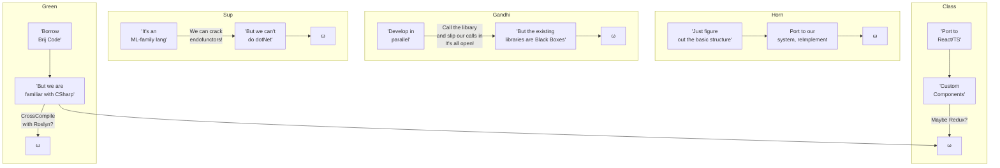
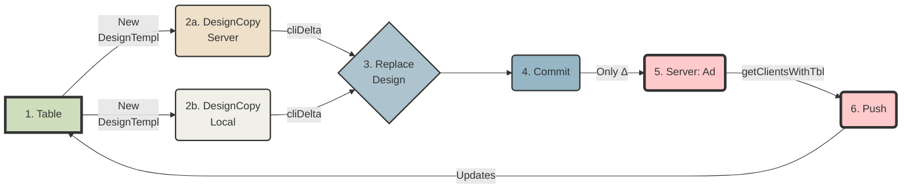
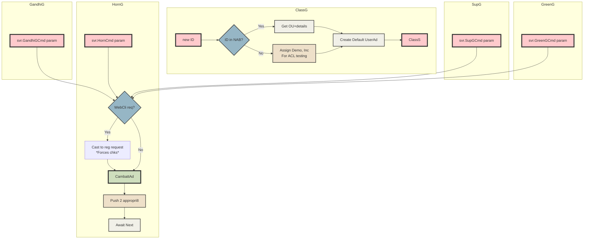
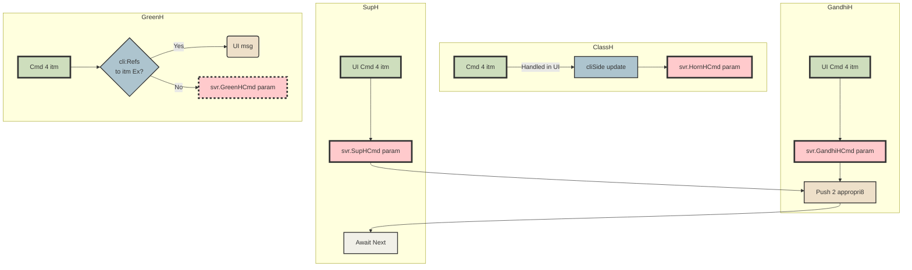
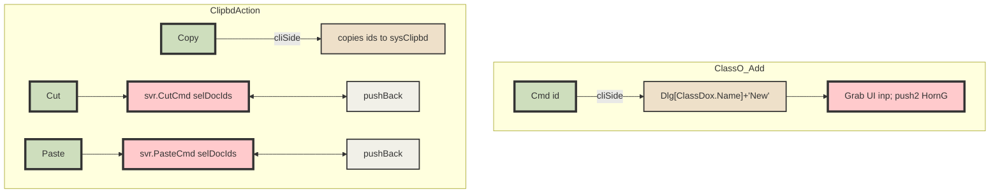

# Table of Contents
- [Architecture](#architecture)
  - [Topology Overview](#topology-overview)
  - [Windowing](#windowing)
  - [Wireframes WebCli](#wireframes-webcli)
  - [Templating](#templating)
    - [Brij flow using ρ setup ->](#brij-flow-using--setup--)
  - [Process Flows `S`](#process-flows-s)
  - [Process Flows `A`](#process-flows-a)
  - [Process Flows `G`](#process-flows-g)
    - [Notes for G](#notes-for-g)
  - [Process Flows `H`](#process-flows-h)
    - [Notes for H](#notes-for-h)
  - [Process Flows `O`](#process-flows-o)
    - [Notes for Other](#notes-for-other)
  - [Reading](#reading)
    - [Spolsky: Simplicity vs Value](#spolsky-simplicity-vs-value)
- [Outstanding Tks](#outstanding-tks)
  - [Tasks+Notes: To Be Checked](#tasksnotes-to-be-checked)
    - [EOY 2023](#eoy-2023)
      - [Updates to Notes.md](#updates-to-notesmd)
      - [Dec 21 b.html updates](#dec-21-bhtml-updates)
      - [Dec 22 Dijit Tree Test](#dec-22-dijit-tree-test)
      - [Wed Dec 27](#wed-dec-27)
    - [From Aug 2023](#from-aug-2023)
      - [PriorVer Info](#priorver-info)
      - [Frm](#frm)
      - [ Validation Rules](#-validation-rules)
    - [From May 22 2023](#from-may-22-2023)
      - [Wnn](#wnn)
    - [From EOY 2022](#from-eoy-2022)
      - [BanarasiP](#banarasip)
      - [MeethooM](#meethoom)
      - [Xtra](#xtra)
      - [EACH Order](#each-order)
      - [Computed Fields (v2?)](#computed-fields-v2)
      - [MeethooP](#meethoop)
      - [DzDV](#dzdv)
      - [FrmDz](#frmdz)
      - [TblDz](#tbldz)
      - [DvDz:](#dvdz)
      - [LookupDocs](#lookupdocs)
      - [Core](#core)
      - [Aux](#aux)
      - [Dat](#dat)
      - [Brij.Expr](#brijexpr)
      - [UI](#ui)
- [General Notes](#general-notes)
  - [Updates to this doc](#updates-to-this-doc)
  - [mBoxes Redux?](#mboxes-redux)
    - [Some approaches identified on Oct 4 '23](#some-approaches-identified-on-oct-4-23)
      - [GitHub has a really great API for creating new Gists](#github-has-a-really-great-api-for-creating-new-gists)
  - [ACL/Role Impl.](#aclrole-impl)
- [Ref](#ref)
    - [Markdown Stuff](#markdown-stuff)
    - [Cookie alternatives](#cookie-alternatives)
    - [JS stuff](#js-stuff)
    - [Colors](#colors)
    - [Agile and CI/CD](#agile-and-cicd)
  - [Reading Shelf](#reading-shelf)
      - [10/13](#1013)
    - [SaaS reading (from a Bing Chat sess.)](#saas-reading-from-a-bing-chat-sess)
  - [Notes from reading](#notes-from-reading)
    - [Indie music submissions (Founder Story)](#indie-music-submissions-founder-story)
    - [HN comments](#hn-comments)
  - [Languages](#languages)
    - [General](#general)
  - [Tools](#tools)
    - [CheerpX](#cheerpx)
    - [Theorem Provers](#theorem-provers)
    - [GitHub alternatives](#github-alternatives)
  - [FsLang](#fslang)
    - [Free Monad w/Interpreter](#free-monad-winterpreter)
    - [TomP's Update Monad](#tomps-update-monad)
    - [Optional Params](#optional-params)
    - [Eliminating Maybes](#eliminating-maybes)
    - [Symbolic Links](#symbolic-links)
    - [More FsLinks](#more-fslinks)
- [Rec](#rec)
    - [Hours](#hours)
    - [PO](#po)
    - [SSO](#sso)
    - [Prints](#prints)
    - [Shows](#shows)
- [Other](#other)
    - [SignalR](#signalr)
      - [Form Post Mechanics](#form-post-mechanics)
    - [Headers](#headers)
    - [allFlds (from baseTkDatAux)](#allflds-from-basetkdataux)
    - [TaskDVAux dat brkdn + raw](#taskdvaux-dat-brkdn--raw)
    - [Code linkx](#code-linkx)
    - [Off-the-cuff](#off-the-cuff)
      - [Tangibles](#tangibles)
      - [Intangibles](#intangibles)
  - [Addenda for Mon Sep 25](#addenda-for-mon-sep-25)
    - [Add to reading shelf](#add-to-reading-shelf)
    - [Oct 2](#oct-2)
    - [Thu Sep 29](#thu-sep-29)
      - [from hn](#from-hn)
      - [ai](#ai)
    - [Thu Oct 12](#thu-oct-12)
      - [Mongo stories/refs from HN](#mongo-storiesrefs-from-hn)
      - [Rec (Noir + bks)](#rec-noir--bks)
  - [Nov 27 2023](#nov-27-2023)
    - [Notes from F#8_What'sNew](#notes-from-f8whatsnew)
  - [Nov 29 '23 (tkList addenda...)](#nov-29-23-tklist-addenda)
    - [Timeline](#timeline)
    - [_mapper.fs_](#mapperfs)
    - [Create a VS Code extension](#create-a-vs-code-extension)
    - [From Dec28 ->](#from-dec28--)


> Note: This doc incorporates the Notes.txt file *BUT* only from Aug_07_23; that was the latest preserved before losing access to the blue SanDsk.


# Architecture

## Topology Overview

> Note: These've been ported to b.html; where they are static.  Any changes here need to be xferred.

`Class`  `Horn`  `Green`  `Gandhi`  `Sup`



## Windowing


  - We nd to prepare/test a whole run of 3-tpls replacing 5-wins
  - Moreover (see img) instd of prop-testing to ensure randomness, gen rand-by-default characteristics (filter unique)
  - Then seed the window with (i) rnd-fn-picked-vals(determine how many) (ii) Peru-generated-vals (determine how many)
  - Given a total window-size (LARGER than earlier, viz. - 5 vals) that is now larger, we automatically have a larger universe and an overall better behavior.
  - Need to impl & test

## Wireframes WebCli
   - GridX
		- [Splash](https://oria.github.io/gridx/) pg    |  [repo](https://github.com/oria/gridx/tree/master)
		- Also has Pag totals from cols/grps, not recs BUT selecting a group selects subRecs
(BONUS) exc 4 qUpd
		- Repo contribs're all IBMers So this is probably the way 2 go
		- **_Local versions_** ->
			- [Tree](https://trivedienterprisesinc.github.io/ui/brij1.html) Grid: Expandoes in different columns (nested), async store
			- [Dod](https://trivedienterprisesinc.github.io/ui/brij2.html) Grid: Details on demand
			- [TBar](https://trivedienterprisesinc.github.io/ui/brij3.html) Grid: Toolbar (doesn't show)
			- [Slanted](https://trivedienterprisesinc.github.io/ui/brij4.html) hdr Grid: Doesn't work in this version
			- Group [Hdr](https://trivedienterprisesinc.github.io/ui/brij5.html) Grid: Details on demand
			- [PagedBody](https://trivedienterprisesinc.github.io/ui/brij6.html) Grid: no pagBar, btns to load more (or auto via scroll)
			- [Summary](https://trivedienterprisesinc.github.io/ui/brij7.html) Grid: Doesn't work - code has remmed stuff
			- [Slanted](https://trivedienterprisesinc.github.io/ui/brij8.html) hdr Grid: Works in this version


   - Dojox
			- dojox: [enhanced](https://trivedienterprisesinc.github.io/ui/dojox_enhGrid_w_Pag.html) Grid w/Pagination
			- dojox: [treeGrid](https://trivedienterprisesinc.github.io/ui/dojox_treeGrid.html)
   - Dgrid
			- dgrid: [gridFromHtml](https://trivedienterprisesinc.github.io/ui/dgrid_gridFromHtml.html)
			- above w/[Flat](https://trivedienterprisesinc.github.io/ui/dgrid_gridFromHtml_Flat.html) schm 
			- dgrid: [treePag](https://trivedienterprisesinc.github.io/ui/dgrid_treePag.html)
				- Pagination totals are for categs, not records (huh?)
   - Form
	- **_Local version_** [Frm](https://trivedienterprisesinc.github.io/frm.html) 
	- Just gen tds svrSide
	- Found flat schemes for ref (see: dev/web/Dojo/links)  Look limp but whatever.
	- _TBar style (normalTxt) until hover_
   - [mBoxNotes](https://trivedienterprisesinc.github.io/mBoxNotes.html) 
   - ES6 [func](https://trivedienterprisesinc.github.io/func.html)
   - (placeholdr) [snip](https://trivedienterprisesinc.github.io/snip.html)


## Templating
### Brij flow using ρ setup ->

- in "Replace Design" ρ allows completely replacing *ALL* dzDocs w/new docs.  Dates are ignored.  It **_is_** possible to repl a Design w/a different/wrong Table; and shd be allowed (Designer's Imperative).  Any reason why we shouldn't follow suit?
- Prompt usr w/ "This will replace...Are you sure?"
- in "Create DesignCopy" prompt w/ location (Svr/Lcl) & below that 2 lines:
    - InputBox(new TableName)
    - Also copy DropDown:[0|200|500|All] Documents for testing purposes

> **Note**: Local/Disconnected/Offline mode in v2?

## Process Flows `S`

```mermaid
graph TB
    classDef yello fill:#F8FF95,stroke:#333,stroke-width:4px
    classDef red  fill:#FFCACC,stroke:#333,stroke-width:4px
    classDef ltBrn fill:#EEE0C9,stroke:#333,stroke-width:2px
    classDef offWhite fill:#F1F0E8,stroke:#333,stroke-width:2px
     classDef drkBlue fill:#96B6C5,stroke:#333,stroke-width:2px
     classDef ltBlue fill:#ADC4CE,stroke:#333,stroke-width:2px
    classDef green  fill:#CEDEBD,stroke:#333,stroke-width:4px
    subgraph ClassS
    cs1[svr.ClassSCmd id]-->cs2{"id known?"}
    cs2-->|Yes|cs3[(Pull AdDox for id)]
    cs2-->|No|cs4[("Add dflt AdDox<br>4 Demo.org; Pass")]
    cs5[render to UI<br>Await Next]
    subgraph Demo.org
cs0>Demo persists settings<br>but tbls ReSet Daily]-->cs00(using Demo allows SwitchId<br>4 ACL Testing via BYPASS)
    end
    cs3-->cs5
    cs4-->cs5
    class cs0,cs00 yello
    class cs1 red
    class cs2 drkBlue
    class cs3,cs4 ltBrn
    class cs5 offWhite
    end
    subgraph HornS
    hs1[svr.HornCmd tblID]-->hs2{"dfltGandhi ∃?"}
    hs2-->|Yes|hs3[GandhiS]
    hs2-->|No|hs4[display<br>CreateInstr]
    hs3-->hs5[Await Next]
    hs4-->hs5
    class hs5 offWhite
    class hs4 ltBrn
    class hs2 drkBlue
    class hs1,hs3 red
    end
    subgraph GandhiS
    ghs1[svr.GandhiCmd id tblID]-->|Equiv.To<br>mnu-SwitchTo<br>_only Diff is cliSide UI_|ghs2[asyncRecv:<br>updateUI]
    ghs2-->ghs3[Await Next]
    class ghs3 offWhite
    class ghs2 ltBrn
    class ghs1 red
    end
    subgraph SupS
    sups1[Cmd docID]-->|Handled in UI|sups2[cliSide]
    sups2 --> sups3[Await Next]
    class sups3 offWhite
    class sups2 ltBrn
    class sups1 green
    end
    subgraph GreenS
    gs1[Cmd docID]-->|Handled in UI|gs2[cliSide]
    gs2 --> gs3[Await Next]
    class gs3 offWhite
    class gs2 ltBrn
    class gs1 green
    end
```


## Process Flows `A`

```mermaid
graph TB
    classDef red  fill:#FFCACC,stroke:#333,stroke-width:4px
    classDef ltBrn fill:#EEE0C9,stroke:#333,stroke-width:2px
    classDef offWhite fill:#F1F0E8,stroke:#333,stroke-width:2px
    classDef drkBlue fill:#96B6C5,stroke:#333,stroke-width:2px
    classDef ltBlue fill:#ADC4CE,stroke:#333,stroke-width:2px
    classDef green  fill:#CEDEBD,stroke:#333,stroke-width:4px
    classDef yello fill:#F8FF95,stroke:#333,stroke-width:4px
    subgraph ClassA
    cA1[Any Δs incl Stngs]-->|Valid8|cA2[Svr.cmd ClassA Δs]
    cA2 --> cA3[Cambatt userAd]
    cA3 --> cA4[Await Next]
    class cA3 ltBlue
    class cA2 green
    class cA1 red
    class cA4 ltBrn
    end
    subgraph HornA
    ha0>Watch for gotchas<br>ρ Horn !Ex <br>Pasting el frm othrTbl leads2...?]
    ha2-->ha0
    ha1[cli.HornA id]-->ha2[run Local Valid8n]
    ha2-->ha1Some{Some Δs<br> involve Dels?}
    ha1Some-->|Yes|ha1DelV{cli:Refs<br> to el Ex?}
    ha1Some-->|No|ha1DelVNo[svr.HornA params]
    ha1DelV-->|Yes|sups2[Handled in<br>UI cliSide]
    ha1DelV-->|No|ha1DelVNo
    sups2 --> sups3[Await Next]
    class sups3 offWhite
    class sups2 ltBrn
    class haA0,ha1DelVNo red
    class ha0 yello
    class ha2 drkBlue
    class ha1Some,ha1DelV ltBlue
    class ha1 green
    end
    subgraph GandhiA
    ghs1[svr.GandhiCmd id tblID]-->|Equiv.To<br>mnu-SwitchTo<br>_only Diff is cliSide UI_|ghs2[asyncRecv:<br>updateUI]
    ghs2-->ghs3[Await Next]
    class ghs1 red
    class ghs2 green
    class ghs3 ltBrn
    end
    subgraph SupA
    supa1[Valid8 cliSide]-->supa2[svr.SupCmd id Δs]
    supa2 --> supa3[Push 2 appropri8]
    supa3 --> supa4[Await Next]
    class supa1 green
    class supa2 red
    class supa3 ltBlue
    class supa4 ltBrn
    end
    subgraph GreenA
    grA1[Any Δs incl Stngs]-->|Push2svr + Valid8|grA2[Cambatt userAd]
    grA2 --> grA3[Await Next]
    class grA3 ltBrn
    class grA2 green
    class grA1 red
    end
```

## Process Flows `G`

### Notes for G
_*Request*_ 
  - reqHandlers For "Expand args" et al already ∃
  - Add member .wobbly() to Defs where necc 

_*Query*_
  - ONLY chng reqd is to xfrm openCats 2 Fltr >> apply >> skip >> take


## Process Flows `H`

### Notes for H
For GreenH et al 'cli:Refs to itm Ex?' 
  - For v1 @ least -> stop right here; make cli removeRefs
  - L8r -> autoRemove/Rename where appropriate.

## Process Flows `O`


### Notes for Other
  - Chk 'New' + pastedEls throughout procFlow for edge cases
  - All TBar actions, some may fall ici.
  - Non-covered dz-types? (Same Logic?)
  - Gen Settings(i) + DzDocs(ii) can be bundled into ClassInit (ClrSchm?) -> ω
  - Handle cliSide: No defaults/Data ∃ 4 Cmd ?? -> "Info + Please create new x by ... "
  - TblDDox(usr, usrSettings) -> ClassDef -> Custom imgs in UsrSettings

# Outstanding Tks
 - [ ] 2024 Top
 	 - [ ] Impl Identity Auth POC
		Notes:
		- nd 2 repl SQLSvr
		- Introduction to [Identity](https://learn.microsoft.com/en-us/aspnet/core/security/authentication/identity?view=aspnetcore-7.0) on ASP.NET Core
		- Improvements to auth and identity in ASP.NET [Core 8](https://devblogs.microsoft.com/dotnet/improvements-auth-identity-aspnetcore-8/)
		- Implement Custom Authorization Policy [Provider](https://code-maze.com/aspnetcore-implement-custom-authorization-policy-provider-in-asp-net-core/) in ASP.NET Core
		- SO: Identity frmwrk w/o Entity Framework and SQL Server?
			- ****Article: Overview of Custom [Storage](https://learn.microsoft.com/en-us/aspnet/identity/overview/extensibility/overview-of-custom-storage-providers-for-aspnet-identity) Providers for ASP.NET Identity<br>
It details no only what Interfaces need to be implemented, but goes into detail on how to implement them and gives code sample references to an actual MySQL implementation
			- ***Article: Identity w/o [EF](https://taherchhabra.github.io/blog/aspnet-core-Identity-setup-without-entityFramework)
			- **https://github.com/MatthewKing/IdentityWithoutEF 
				MVC, but has foll: (only 2 interfaces nd to be impl: user,role)
			    services.AddSingleton<IUserStore<ApplicationUser>, ExampleUserStore>();
				services.AddSingleton<IRoleStore<IdentityRole>, ExampleRoleStore>();
				services.AddTransient<IEmailSender, EmailSender>();
			- https://github.com/bytutorial/asp.net-mvc-identity-without-entity-framework
Earlier links
   - Todo [app](https://github.com/davidfowl/TodoApi) with ASP.NET Core Blazor WASM, Minimal APIs and Authentication
   - <a href='https://learn.microsoft.com/en-us/aspnet/core/security/authorization/roles?view=aspnetcore-7.0'>Role</a>-based authorization in ASP.NET Core<br>
   - Using <mark>Custom schema</mark> w/aspNetC Identity:<br>
		- 2018 <a href='http://danderson.io/posts/using-your-own-database-schema-and-classes-with-asp-net-core-identity-and-entity-framework-core/'>article</a><br>
		- <a href='https://stackoverflow.com/questions/21529291/asp-net-identity-use-custom-schema'>SO</a> qn<br>
		- Article: dotNet Identity with Dapper instd of [EF](https://web.archive.org/web/20220126053132/https://markjohnson.io/articles/asp-net-core-identity-without-entity-framework/)
			(also contains in comments an impl of IUserLoginStore) repo: github.com/mark-j/dapper-identity
			HOWEVER uses Dapper (an ORM from SO)
		- MongoDB.AspNet.Identity is a MongoDB backend provider that is a nearly in place replacement for the EF version.
			https://www.nuget.org/packages/MongoDB.AspNet.Identity/
			https://github.com/maxiomtech/MongoDB.AspNet.Identity
			Requires only 1 mongo document type

Kevin Chalet (OpenIddict): The real bait and <a href='https://kevinchalet.com/2021/05/24/asp-net-core-6-and-authentication-servers-the-real-bait-and-switch-is-not-the-one-you-think/'>switch</a>
OpenIddict<a href='https://github.com/openiddict/openiddict-samples/tree/dev'>samples</a>

SO: multi-tenancy in <a href='https://stackoverflow.com/questions/2748825/what-is-the-recommended-approach-towards-multi-tenant-databases-in-mongodb'>MongoDB</a>
SO: Use one db w/'<a href='https://stackoverflow.com/questions/44511576/multi-tenanted-db-strategy-for-document-id-and-authorization?noredirect=1&lq=1'>tenantID</a>' fld
 	 - [ ] Impl oAuth POC
 	 - [ ] Impl wasm POC

<h3>Using a gist for io in a wasm app</h3>
<ul><li>Use Github API to update a <a href='https://docs.github.com/en/rest/gists/gists?apiVersion=2022-11-28#update-a-gist'>gist</a>
</li><li>(above avail 4 <a href='https://docs.github.com/en/authentication/keeping-your-account-and-data-secure/managing-your-personal-access-tokens'>fine-grained</a> access tokens)
</li><li>See also C# webCli code <a href='https://stackoverflow.com/questions/18960868/how-to-create-a-gist-on-github-with-basic-authentication-in-c-sharp'>here</a>
</li><ul><br>
<b>Note: Above not necc., can use default GITHUB_TOKEN</b> Kept for ref.

For pushing wasm 2 gh-pages, see <a href='https://dev.to/swimburger/how-to-deploy-asp-net-blazor-webassembly-to-github-pages-44o'>swimburger</a><br>
(also has many gotcha fixes incl GH using jekyl which ignores '_framework')

GH Actions: To run a workflow manually, the workflow must be configured to run on the <a href='https://docs.github.com/en/actions/using-workflows/events-that-trigger-workflows#workflow_dispatch'>workflow_dispatch</a> event.
<br>see also: Providing args to yr workflow via <a href='https://docs.github.com/en/actions/using-workflows/events-that-trigger-workflows#providing-inputs'>env</a>

 	 - [ ] org: Impl flyout; continue impl
 - [ ] General
 	 - [x] Nd to chk bundle reqmts 2 run dotNet in new env.
 	 (Note that other tasks e.g. Svr depend on this task)
 - [ ] DnD Impl
	 - [x] Dynamic bld (10/11/23)
	 - [x] bld operational, tested (10/11/23)
	 - [ ] Monadic state upd8t on DnD
 - [ ] Wireframes Tabbed PropBox
 	 - [ ] reimpl frm w/declarative|domConstr
	 - [x] New Tys 4 tabbedPgs
	 - [x] New Tys 4 PropBox (bld via above)
	 - [x] New Ty incorp8ing all propParams >> dzEl
	 - [ ] Make ctxtMenus modular, test w/curr setup
	 - [ ] Reuse/reImpl 4 other els
	 - [ ] Use ResX for assets
 - [ ] Wireframes WebCli
	 ***Status'24: Alm complete; see notes inside impl.***
 	 - [ ] Impl/test Grid. **See** [Notes](https://trivedienterprisesinc.github.io/CP_Logic.txt)
	 	 - [x] Impl barebones working test ver w/all func necc.
	 	 - [_] Refactor code to accept direct defs
	 	 - [x] Refactor code to accept dat in more or less similar fmt
	 	 - [ ] Ensure all necc mods in place (auto-col-resize etc.)
	 	 - [x] Essentially all func shd mirror Desktop + use same params (Cleaner on svrSide)
	 - [ ] Impl/test Forms. **See** form [tester](https://trivedienterprisesinc.github.io/frm.html) *** 50+% complete***
	 - [ ] Hold off for now on impl Auth
 - [ ] Import Module
	 - [ ] We nd an **_export_** mod too; the main task here is to determine which internal flds to expose (Pros: easy rebuilding of cli backed-up dbs; Cons: exposure) 	
	 Basic func only (also nded for `ReddHat`)
	 - [ ] Impl/test; just basic func will do **_this is the last major mod left to complete_**
	 - [ ] File|New >> 'Do you have a data dump (CSV) file? 'hlp:what is this?' ie, yes/no dlgBoxes; no wizardLike stuff.
	 - [ ] Ideally use continuationMonad to terminate if errors > preset %age limit of totalInputSz i.e., **deterministic** flow with prompt + option to continue/break.

- [ ] Svr
	 - [x] Setup/test chat svr
	 - [ ] Port to F#
	 - [ ] Begin impl custom stuff
	 - [ ] AutoDownload (cli+dsk) on 1st login
	 - [ ] Add get/post capab from non-stdrd cli.s
	 - [ ] Chk post mechanics SigR (see [this](https://gist.github.com/TrivediEnterprisesInc/51c145a2b1de80cdac0c0e11024064c4#signalr))
-  [ ] Embedded Dox
	- [ ] Impl.   see [notes](#nestedembedded-dox)
-  [ ] Calculated Flds
	- [ ] Impl.   see [notes](#subforms)
-  [ ] SubForms
	- [ ] Impl.   see [notes](#subforms) and notes under [SummaryRow](@summaryrow)
 - [ ] Windowing
	 - [ ] @ this pt. or at any pt. earlier (@mbi) switch 2 completing all outstanding tks under this umbrella
- [ ] Demo(s)
	 - [ ] Poss utility in separate demos 4 scenarios 
	 - [ ] ReddHat
	 	- [ ] Find online src 4 canned order frm; use/reImpl
	 - [ ] Canned Db example (v2?): Need one with 'Orders' **_embedded_** (n.b. 32M limit so no go for blogs CMSs etc.) WITH example embedded form, full functionality
-   [ ] DbClipboard
	- [ ] Impl/test
-  [ ] DbFuncs
	- [ ] Impl MessageBox queue to proc
	- [ ] Will run as Indep svc full-time on svr
	- [ ] Will def nd 2 offer users ability to trigger on Save/Update
	- [ ] Offer some canned fns e.g. **_sendMail_** aka transactional emails 
	- [ ] Offer triggers 4 *_onEvent|manualRun|hourly|daily|wkly|monthly_*
	- [ ] We have sketched out the types for this elsewhere (@ToDo: loc8) what's key is **_LastRunOn_** and **_LastRunStatus_**; the currRn will collect docs/filter based on these flds.
	- [ ] The assoc dox 4 dbFuncs will go into the AdDb (nd to impl ids etc.)
	- [ ] Cron + C# ->
		- [ ] [CronNET](https://github.com/kevincolyar/CronNET) is a simple C# library for running tasks based on a cron schedule.
		- [ ] Schedule Cron Jobs using [HostedService](https://github.com/dotnet-labs/ServiceWorkerCronJob) in ASP.NET Core
		- [ ] see also: https://github.com/kdcllc/CronScheduler.AspNetCore
		- [ ] OFF-THE-SHELF PKG: Job Scheduler for netCore/aspDotNet (hugely [popular](https://github.com/quartznet/quartznet))

Notes (Dec09_23)
<br>
<b>Related</b>: we can pro'lly use a 'MainAdTbl' which's a storehouse 4
stuff like cliInfo/Keys (no outside access); & this cd host the dbFuncDocs
If there're too many can be isolated per case.
<br><br>

No immed/manual; set min @ 15 min (this is 4 RunOnce)
then hourly/daily/wkly/monthly
<br><br>
(If not polling; load'll be much less; this just runs on a freq.)
<br><br>
Trigger proc to runOnSvr ev 15m; look at dbFunc docs (AdTbl)<br>
1 if (intvl = runOnce) && (LastRunOn != never), del doc<br>
2 if (timeSinceLastRun > intvl), put in msgBox Queue<br>
3 After run, if succ, push (LastRunOn; LastRunStatus) to dbFuncDoc<br>
4 dbFuncs'll nd to run Qrys e.g. for (newCustomers w ord > $1k since lastRun)<br>
  For now just gen list to cons; l8r we can setup service queues.<br>
<br>
- [ ] Org
	- [ ] mBoxes
		- [ ] Port Notes 2 mBoxes (see [this](https://gist.github.com/TrivediEnterprisesInc/51c145a2b1de80cdac0c0e11024064c4#mboxes-redux)); add tab func
			- [x] Began work, basic stuff done; extracts content see [this](https://trivedienterprisesinc.github.io/mBoxNotes.html)
		- [x] Complete priorTk: dlgBox 4 contents (curr uses msgBx)
		- [ ] Determine whether to use a Form 4 entry.  See notes (link above) 4 options; cld always do them serially as be4
		- [x] 1st port Notes (this doc) + from sys
		- [ ] Port snippets et al aussi
		- [ ] Incorp in2 bkmrks
- [ ] Research
	- [ ] Myers/Briggs & current updates
		- [ ] How 2 best ask pointed Qns/gather info?
		- [ ] Tailored decision trees per user ty?
	- [ ] Auth
		- [ ] Mongo realm/ roll-yr-own (lk 4 c#) must accomodate webTkns
		- [ ] look also @repl/GitH setup on their repo

- [ ] Backend 
   - [ ] @rsch BsonDoc [Qry](https://gist.github.com/TrivediEnterprisesInc/51c145a2b1de80cdac0c0e11024064c4#qry)
   - [ ] Collect all poss mongodb Qry params; incorp into code; impl.
- [ ] Rec
	- [ ] Need to begin creating/adding to bkmrks/Gear et al

- [ ] Dat
	- [ ] Chk w/frmwrk instd of netCore
	- [ ] Can we run LoggedUI (only rel parts w/o UI) to regen?
	- [ ] Nuget 4.6 is platform-indep (? is it?) so cld try in shell
      		- via fat OR
      		- via reInstall
- [ ] Nd Reset
- - - - - - - - - - - - - - - - - - - - - - - - - - - - - - 
winFrms Gist Hdr Updates

<<note this this ver of the file contains mods perm onwards; recover prior?>>

(betw frmDelta + clientInit)
dizCopy (has templating handlers/logic + li<allPossHndlrs>)

(after clientInit)
propBox (much compl)

(after dndOps)
DnDMonad 

## Tasks+Notes: To Be Checked


### EOY 2023

#### Updates to Notes.md
* most itms under Ref & Other moved to b.html (e.g, Tally); chk & remove frm here

#### Dec 21 b.html updates
 incl <a href='https://paste.fo/raw/m7732228eb81'>highlight.js</a> plus fixes to existing dev/misc alignmt issues (were aligned center in titlePnl(?!))
* nxt: (consider) repl all detail sections

#### Dec 22 Dijit Tree <a href='https://paste.fo/raw/15b04fcb3c83'>Test</a>

#### Wed Dec 27

*  ELO rtng: how 2 filtr (utils exist?) (3 lvls; determine which; filter out bottom)
*  How 2 use existing bd for this?
*  2 btns: 1st shows _next_, 2nd shows _curr_
*  Nd beaucoup articles/refs/lit: publicDomain, embed.  All of CM is evidently pd (confirm)
----
* Taking Kiersey further (farther?) @rsch motivation: prompts, what kind nded when, application, results.
----
* For rtEd; find an appropriate widget to embed & see before/after parsing results in all modes.  Consider regExRepl 4 customEls, p'haps w/props exposed for advanced usrs to edit in-place
* Flatten types of content to just one; simpler overall
* @rsch bookmark fileFmt 4 all browsers
* No ver capab 4 now, v2+
* Random pnlHdr colors assigned based upon _last_ of differentiators; customizeable by usr
* TopPnl shd incl srchBtn offering ftSrch capab; sorted by count (as b4); ttip in ctxt -> reimpl in Fs
----
* Img/Attachment hndlrs 4 svr: modify staticHndlr to recv docId: url/img/docId/nm.ext & pull from relevant doc.  This shd work whether or not we use a specific imgTbl
----
* Continue srch for gd UI tabPullout thingie (1st pref css only, then js)
----
* **b.html update**: nd to embed all flowcharts using mermaid b4 Notes.md can be retired.

### From Aug 2023

#### PriorVer Info 
w/in doc?  Array?  If so, how to update changes?
#### Frm

> Note: This section kept only for reference; work on Dnd (Oct 4) supersedes this, avoids the selection issues, elegantly (!) solves all problems while offering all reqd functionality.
	
<del>Ability to draw boxes/groups around fldPnls -> p'haps shd draw in the Background (zOrder) and moveBtns ignore it; otherwize it'll cause havoc w/layout (will nd to identify units, grouped itms become single unit, etc. FeatureCreep) 
**Sep18_23**
No, this is doable, and also modular.  Here's how: 
  - Add pnl member x.isChild + x.Container; popul8
  - Impl. movement actions *Within* the container.
    If usr clicks up & pnl.Row = 0 => beep() (likewize other dir.s)
  - Amend curr pnlMoveBtn.Click to `(fun e -> 
    let localRow, localCol = 
      match x.isChild
      | true -> Container.Row, ContainerCol
      | _ -> frm.Row, frm.Col
    ...normal flow w/new vars...)`
  - Impl a ctrlGrp as an item; *_CONSIDER_* adding props to ea pnl using above handler instead of matching; this way it remains simple + noEdits.</del>
  - @ToDo: Related: Do we or do we not currently have a !!^ "fldIntnlNm" [ctrl] -> frm??  We nd this pronto.  
  - @ToDo: Related: We nd to impl either SelectionHandles (@rsch again: winFrms repo src) or (easier approach somewhere on SO: selecting ctrl paints a crosshatch rect on top)

####  Validation Rules
on Compose: see if we can use the ∃ing Form Funct w/fns (for hlp popup)

### From May 22 2023

#### Wnn
  - Run #s w/ tot 5 -> (1) Visible (2) Trivia (Rnd())
  - All Local ver of VSCd portable w/Lang Svr 4 AutoComp?
  - OR run from Partition w/o inet (How determine?) (switch Part.s poss?)
  - OR ChromeOS? Some other OS? Min ver of Linux?
  - Needs to allow compil8n; which opens up vulnerabil.s galore
  - How to disable/lock open ports?  (SysTray lock @rsch)
  - Medium article on Defensive Prog (incl refs to Adapter Pattn/wrkBnch)
  - <mark>Jimmy -> Auth -> Mount -> App on JVM</mark>

### From EOY 2022
#### BanarasiP
  - How to handle intl flds? Disabled? Title etc. nded
  - More wids
#### MeethooM
  - As above, nd to handle intl flds (No renaming or fldTy chng allowed)
  - Reapply Fns as Cats et al
#### Xtra
   - Sketch out HlpSys
   - For Push/SigR -> Use a DzDv
`Combo Pipe D |> Lst F calls .show() |> B4 ret (mut/refdl <- d) |> Persist`

#### EACH Order
   - Some Impl Reqd (eg Dat HardCoded; Wids incompl but coverage there)
   - Apply Combs

#### Computed Fields (v2?) 
  (**Jan13_23**)  It mt be a gd idea to offer an Expr Bldr which uses ParserCombs under the cover; this wd allow MUCH more userFunc; e.g.:
 `fldContents contains "exactlyOne '(' +  oneOrMore digits,     exactlyOne ',' + oneOrMore text/anyChar + ...."` matches populate computed fld which can be proc'd as usu.

#### MeethooP
```
    let icnLbl = new Label(Image = brijLogo, Size = (new Size(brijLogo.Width, brijLogo.Height)), Anchor = anc "N", BackColor = Color.Transparent, ForeColor = (currentScheme ((!!~ "wld" dsk).Value)).Icn()) 
     
    let titTxt = new TextBox(AutoSize = true, Dock = doc "T", Enabled = false, Text = "Meethoo Def Document for " + nm, ReadOnly = true, Multiline = false, Width = f.Width - 50, TextAlign = HorizontalAlignment.Center, BorderStyle = BorderStyle.None, ForeColor = (currentScheme ((!!~ "wld" dsk).Value)).titFore(), BackColor = (currentScheme ((!!~ "wld" dsk).Value)).titBack()) 
    let titleP = new TableLayoutPanel(RowCount = 1, ColumnCount = 5, Dock = doc "T", BackColor = (currentScheme ((!!~ "wld" dsk).Value)).titBack(), AutoSize = true, Width = f.Width , Height = ((int) (titTxt.Height * 3))) 
    (midP) lv: , ForeColor = (currentScheme ((!!~ "wld" dsk).Value)).accentFore(), BackColor = (currentScheme ((!!~ "wld" dsk).Value)).accentBack()) 
-----
પ્રેડ_પીચાક (+ ચેક્ડ_પીચાક)
એક્સ_પેનલ
કેટ_બાય_પીચાક
```
#### DzDV
>@ToDo ~ Nov27 2022->
    - 1st DV is deflt (?@tbd); ability to set in CalcDef: checkBoxes
    - new TSBtn "Create Copy" for dzDox (upd Sept18_23: No, just allow access transparently via normal tbar Cut/Cpy/Paste btns)
-----
Existing mods: continue as b4 
ALL new mods:  keep CoreAux open; use new conventions 

-----
>@ToDo ~ Nov9_2022

mod AutoOp Brij.Canned <- all suppliers; f 'a x -> x 

#### FrmDz
 -  Layout Logic
 - InfoBox etc. (remaining wids)
 - Cleanup
 - Validation
 - PredBldr
 - Pullout LV 2 cls

#### TblDz
new() frm abv
#### DvDz:   
Boyz; use ArrowPnl [] -> [] with upDn btns
 - Chooser
 - AutoSetup
#### LookupDocs
 - Nd frm/Dlg 2 UI
   Basically impl couple in mock scenarios to determine path 

#### Core
* Nd a new tpl: sTpl: not a list? for dat HashMap entVs 
        @ToTEST: can we just get by w/box? 
        IF we nd new one for just the types, EXTEND? 

**From 6/5/23 ->**
* Modify st.Bind to call >!>
        * `? {let x = get; do! ? {...}`  
        * Q: can we avoid using x (bind takes f not fx?)
* Idris 4 utils? [[***Compiles 2 C***]]

#### Aux
 - Do amish 4 3 lists; 1st all 8 & 2nd half-ish  if (1) elif (2) elif (3)...
    * NO existing replaced 4 now 
    * After in place mt be a good time to clean mods & 
      move new Core fns in since we now have a working dll set. 

#### Dat
 - Continue w/adding updated dat fns until all consumed

#### Brij.Expr

 - The only place we act'ly nd dyComp is after types change in ???
 - The rest can/shd be handled via exprShape
 - **@ToDo** test embedding exprs within others (shd work)
 - **@ToDo** find best way to store these
 - **@ToDo** determine whether a sep expr is nded for crit.

#### UI
**Note** module Form uses Task etc. types from Brij; consider moving entire mod to a separate fork

 - recr ty / basic frame; add pointLess, fix w/Dirs, no comb
 - new tag/tpl/st single runC in ea Mod
 - sketch out basic data + popDat
 - bur p x y shd rem matches (?)
 - tst: push 3 params + Comb 2 tags; put thro + brush
      - simulate via map/list/whatever
      - if comp compl use cq |> eval
 - ONCE above verified -> basic 5 (3param) + add'l 4(or as nded) -> **_Commando mode_**

# General Notes
## Updates to this doc
   - Under `To Be Checked` we curr have stuff like PriorVer Info & ACLs
     Cre8 new sections 4 these & move there so they can be expanded upon
   - The winForms [gist](https://gist.github.com/TrivediEnterprisesInc/987b23e0a256182a0ac29bb36820d6d9)

## mBoxes Redux?
  - We nd a b8r way to org these notes; MD fine but not v searchable; so revert to mBoxes w/tags
  - Bld a quick/dirty input frm & persist a la snippets

### Some approaches identified on Oct 4 '23

#### GitHub has a really great API for creating new Gists
**_ Use this? _** 
Cons: 
- nd 2 be logged in
- nd 2 clean up
Pros: 
- no data loss ever
- no nd 2 cleanup pastes.io

## ACL/Role Impl.

| | Create | View | Edit | Delete |
|----| ----| ----| ----| ----|
| **Reader** |  |  | ||
| **Author** ||  |||
| **Editor** |  |  |  ||
| **Admin** |  |   |||
	
**Levels**: | Doc | Form | Tbl | Sys |
	
# Ref

### Markdown Stuff
   - Mermaid [cheatsheet](https://jojozhuang.github.io/tutorial/mermaid-cheat-sheet/)
   - Mermaid theme [customization](https://mermaid.js.org/config/theming.html)
   - Markdown [Editor](https://stackedit.io/app#)
   - [TOC](https://imthenachoman.github.io/nGitHubTOC/)  Generator
   - Markdown2html [converter](https://markdowntohtml.com/)
### Cookie alternatives
**_4 local Browser Storage_**

(i) The Web Storage API (HTML5) 
Includes localStorage and sessionStorage (autoExpires) 
Best used for client-only data.
```
  localStorage.setItem('value1', 123);
  localStorage.setItem('value2', 'abc');
  localStorage.setItem('state', JSON.stringify({ a:1, b:2, c:3 }));
  const state = JSON.parse( localStorage.getItem('state') );
  localStorage.removeItem('state')
  .length: the number of items stored
  .key(N): the name of the Nth key
  .clear(): delete all stored items
```
Current browsers(2013) limit total size per storage area to 5MB.
Changing any value raises a storage event in other browser tabs/windows connected to the same domain. Your application can respond accordingly:
```
  window.addEventListener('storage', s => {
    console.log(`item changed: ${ s.key }`);
    console.log(`from value  : ${ s.oldValue }`);
    console.log(`to new value: ${ s.newValue }`);
  });
```
(ii) IndexedDB, an in-browser database system:
While localStorage performs all of its methods synchronously, IndexedDB calls them all asynchronously. 
IndexdDB [API](https://www.w3.org/TR/IndexedDB/)
Benefits over Web Storage:
- efficient searches
- db, so can store multiple same keys
- transactional
- no size limits: FireFox asks if exceed 50Mb
create db:
```
  var request = indexedDB.open(“myDatabase”);
```
set obj store:
```
  const petData = [
    { id: “00-01”, firstname: “Butters”, age: 2, type: “dog” },
    { id: “00-02”, firstname: “Sammy”, age: 2, type: “dog” }
  ];
```
to chng schema:
```
   request.onupgradeneeded = function(event) {
      var db = event.target.result;
      var objectStore = db.createObjectStore(“customers”, {keyPath: “id”});
      for (var i in customerData) {
        objectStore.add(customerData[i]); }}
```
	
### JS stuff
[loDash](https://github.com/lodash/lodash) *25m usrs*
https://lodash.com/ 
Lodash makes JavaScript easier by taking the hassle out of working with arrays, numbers, objects, strings, etc.
Lodash’s modular methods are great for:
  - Iterating arrays, objects, & strings
  - Manipulating & testing values
  - Creating composite functions


[Ramda](https://github.com/ramda/ramda) *.7m usrs* 
[docs](https://ramdajs.com/docs/#) & repl


[Immutable](https://github.com/immutable-js/immutable-js)
Immutable.js provides many Persistent Immutable data structures including: List, Stack, Map, OrderedMap, Set, OrderedSet and Record. 
Immutable.js also provides a [lazy Seq](https://github.com/immutable-js/immutable-js#lazy-seq), allowing efficient chaining of collection methods like map and filter without creating intermediate representations. 
Lodash wrapper providing Immutable.JS support: [MuDash](https://github.com/brianneisler/mudash)


[Underscore](https://github.com/jashkenas/underscore) *2m usrs* is a utility-belt library for JavaScript that provides support for the usual functional suspects (each, map, reduce, filter...) without extending any core JavaScript objects.

(all 4 are MIT)

>> Super resource [here](https://github.com/you-dont-need/You-Dont-Need-Lodash-Underscore)
(try this 1st) **refered 2 as YDN in this doc**
 (You Don't Need Fnal JS libs; use native instd)

Lodash seems to have HUGE support built in; but 1st try YDN; if stumped often switch.


```
lodash reduce (same as lifo)
_.reduce([1, 2], function(sum, n) {
  return sum + n;
}, 0);
// => 3

// Native (YDN)
var array = [0, 1, 2, 3, 4]
var result = array.reduce(function (previousValue, currentValue, currentIndex, array) {
  return previousValue + currentValue
})
console.log(result)
// output: 10
```

	
### Colors
[Palettes](https://colorhunt.co/palettes/popular)
```
let sublime = 
    fore:Color.Black, back:sYellow,
    AccentFore:sLtGrn, AccentBack:sYellow, 
    TitFore:sDkGrn, TitBack:sDrkYell, Icn:sBrn))
```

### Agile and CI/CD
A gd article (SVPG) commending **small, frequent releases** says that if you're not doing this you're by def not Agile; the whole point is that if they're small it's easy to fix the bugs else (even a 6-mo realease) will yield so many bugs that the next few releases will be spent catching up.


    

## Reading Shelf

Andrew <a href='https://andrewlock.net/'>Lock</a>'s blog ("certainly one of the best .NET blogs out there!"-openiddict's Chalet)

#### 10/13 

  - https://12factor.net/
  - Free and Open Source Machine Translation API: https://github.com/LibreTranslate/LibreTranslate
  - *** form posts w/new syntax .net [8](https://andrewlock.net/exploring-the-dotnet-8-preview-form-binding-in-minimal-apis/)
  - Personal websites? There are way more of them than there were "back in the day", you just have to know how to [find them]( https://search.marginalia.nu/)
  - Show me yr half-baked [project](https://news.ycombinator.com/item?id=37857231)

	
@ToDo: Add updateable links to Culture (hn + lobst) et al...
  
**everything** by Alexis King (he wrote Parse, don't validate.  v lucid, 

**Monoliths** (revisit DanLuu?) 
**No microSvcs/Kube**: Dropbox, YouTube, Instagram, Facebook Blue, Shopify
**CoLocating instd of Cloud**: Squarespace, Twitter, Basecamp, StackExch

Kellan's 'Software & its discontents' (3parts) 'tries to ans the qn: why is ev so miserable about sw these days?'

rc3.org/2015/03/24/the-pleasure-of-building-big-things/
martinfowler.com/bliki/PolyglotPersistence.html
mcfunley.com/why-mongodb-never-worked-out-at-etsy
boringtechnology.club/ (somewhat opinionatd)

[How abstractions help w/tech conversations](https://blog.icepanel.io/2022/10/23/abstractions-in-system-architecture-design)

["The Latest Stack"](epicweb.dev/epic-stack)

["You've created an env to bld something quickly in 7 mos but your engineers will pay for 7 yrs"](engineering.ramp.com/elixir-at-ramp)

['Mindful choice of tech gives eng real freedom: to comtemplate bigger qns'](mcfunley.com/effective-web-experimentation-as-a-homo-narrans)

**0instal** case study (DanLuu ref; auth:**Leonard, T**) comparing Python to other choices incl C#, settles on OCaml 

Smallshire presents an F# prog that can't catch a certain type of bug via its type sys (DanLuu: can't say if it was masterful trolling)

current (Fri Sep22):
 - https://towardsdatascience.com/dirty-secrets-of-bookcorpus-a-key-dataset-in-machine-learning-6ee2927e8650
 - https://jdk.java.net/21/release-notes
 - https://www.levels.fyi/blog/trends-remote-salaries.html
 - [unread](https://www.semafor.com/article/09/15/2023/the-princeton-researchers-calling-out-ai-snake-oil)
 - Github [AIops](https://github.com/search?q=aiops&type=repositories&s=stars&o=desc)
 - Github [MLops](https://github.com/search?q=mlops&type=repositories&s=stars&o=desc)
 - repos GitHub 'courses'
   1. ML [ops](https://github.com/GokuMohandas/mlops-course)
   2. Data Science [Overview](https://github.com/hemansnation/God-Level-Data-Science-ML-Full-Stack) w/@least 2 gd chapters worth exploring
 - Gen AI's [Act2](https://www.sequoiacap.com/article/generative-ai-act-two/)
   ...Examples of companies entering “Act 2” include [Harvey](harvey.ai), which is building custom LLMs for elite law firms; [Glean](glean.com), which is crawling and indexing our workspaces to make Generative AI more relevant at work... (from above) GenAI [Stack](https://www.sequoiacap.com/wp-content/uploads/sites/6/2023/09/generative-ai-model-stack-3.png?resize=1920,2560)
 - Refs 2 Classical Chinese [handscrolls](https://www.wired.com/story/lexicon-scroll-doomscrolling-mindfulness-linguistics/) & assoc. colophon comments, v gd fodder for '...1k wds...' ref:
   'famous handscroll Along the River During the Qingming Festival, a
   Song dynasty scroll that has been called China’s Mona Lisa. '

	
### SaaS reading (from a Bing Chat sess.)
  - Why I Almost Walked Away From the $500k/mo Company [I Founded](https://www.groovehq.com/blog/almost-walked-away)
  - What I Learned Rescuing Our Startup From [Death](https://www.groovehq.com/blog/rescuing-startup-death)
  - The Top 20 SaaStr Tips to Getting a SaaS Start-Up [Going](https://www.saastr.com/the-top-20-saastr-tips-to-getting-a-saastr-start-up-going/)
  - Inc’s 50 [Best](https://www.saastr.com/incs-50-best-websites-for-entrepreneurs-saastr-is-36/) Websites for Entrepreneurs
  - 12 Key Levers of SaaS [Success](https://www.forentrepreneurs.com/saastr-2017/) 2017
  - "Zero to 100" for High Growth SaaS - A workshop on how to build your [Go-to-Market](https://www.forentrepreneurs.com/zero-to-100/)
  - Learn more about [product-led growth](https://userpilot.com/blog/ultimate-guide-product-led-growth-saas-2021/)
  - The SVPG insights blog is great for [product managers](https://www.svpg.com/articles/) looking to stay up-to-date with the industry and advance their skills. 
  - The Brad [Feld](https://feld.com/) blog is one of the best VC blogs dedicated to entreps and investors. 
  - The [Openview](https://openviewpartners.com/blog/) blog focuses on product-led growth, product & pricing, marketing, finance & operations, and many more. 
  - [SaaSMetrics](https://saasmetrics.co/) SaaS Blog 


## Notes from reading

### Indie music submissions (Founder Story)
(from [IndieHackers](https://www.indiehackers.com/interview/building-a-55-000-mo-saas-business-promoting-artists-music-d2f45dd860), Aug 2020)

- Jason blt music blog - ran it for 7 yrs - recd 300 pitches a day from artists/lbls/publicists looking to have their music featured
- Spent 10 mos blding SubmitHub: ...my main focus was on solving my own problem. I hadn't given much consideration to the thousands of other music blogs who might want to use it. I suppose in that sense I was lucky: I was already "part of the problem", and therefore had a good understanding of what was needed to "solve" it...
- Over the course of my ~7 years running a blog, I had learned a few things about what folks were looking for when they sent music to blogs:
        1.  a quick response
        2.  a decision about whether it was worthy of being blogged
        3. and, if not, some detail as to what needed improvement
Therein lied the business model: by paying a small amount ($1),  [SubmitHub](http://www.submithub.com/)  would be able to guarantee that all three of the aforementioned boxes were checked. If not, the user would receive a refund.
 - **Advice to aspiring hackers**: Launch and iterate! Don't delay! I've seen a number of startups try to build the perfect product before launching, rather than putting something out there and adapting to the needs of its users. My experience has been that building a platform around real-life, participating users is much more valuable than trying to guess what they'll need before you've even put the product out there.
 - Payments powered by [BrainTree](https://www.braintreepayments.com) min
### HN comments
**_theunixbeard_**
1.) Build an audience (~6 years)
2.) Build your business (a few months...)
That's the winning formula. I wrote about this at length regarding Ryan Hoover & Product [Hunt](https://medium.com/@theunixbeard/product-hunt-s-rise-d49249a1a2c0)
The title was "Product Hunt's Rise: An overnight success 1,834 days in the making"... Same exact story here except growing Indie shuffle took closer to 2,190 days!
[  
**_paulsutter_**
Or maybe the lesson is to <mark>develop a following first before developing a product</mark>. The music blog didn't happen by random chance, and his overall approach seems better than developing a product and hoping for a following.

**_gloverkcn_**
If you look at any marketing funnel, the first hurdle is awareness. <mark>Getting people aware of a saas product is very difficult. Getting them to try it is even harder.</mark>
Having the blog provided both a vehicle to get the target market aware, and the credibility that the product is worth trying. It's really smart to be an active member of a community, and then provide services to the community. It's also very difficult, and takes a lot of effort. I think the post you responded to is someone who understands the amount of work you had to put into your blog to make it successful.
I don't think this is a negative, but a really good take away for new entrepreneurs.
- How will you market and sell your product? The "If you build it, they will come" tactic doesn't work.
- How do you know it's a problem people want solved?
- How do you know your solution adequately solves the problem ?
Your approach answered all these questions and you got to work on something you're passionate about.

**_blazespin_**
He missed the advice of <mark>launch and iterate below the radar with a very narrow group of customers</mark>.
For example: on the app store you can launch your app/game in countries <mark>other</mark> than the US (australia, canada). Iterate, and once you're satisfied, than launch in the US.
Launching and iterate in the fully public eye of your customer base is a risky thing to do for your general brand value.

**_trymas_** 
It reminds me of a story how Red Digital Cinema Camera Company was born.
Few years ago I've found a motivational article that everyone can make a successful business out of their garage even in the field of <mark>high end technology.</mark> I googled RED camera's founders name - multi-billionaire founder of Oakley. Probably his garage looked like a high tech version of Jay Leno's car garage and not like the Jobs' and Wozniak's garage.
Dude have been building his blog business/image/trademark for many years and successfully capitalised on that. Kudos to him.

## Languages
### General
Twitter went from RoR to *Scala*
*Erlang*
"most Erlang progs contain no or v. lil type info"
Heroku, WhatsApp (only 35 engineers) used Erlang
*Ruby*
"Dynamic, OO (!), de-facto choice for MetaPr"

> @rsch: ITA (used *Cmn lisp*) $700m acq by goog

## Tools
### CheerpX
Run Flash on WASM

### Theorem Provers
ACL2, Isabell/HOL, PVS (ref from DanLuu 'in my corner these're the provers we're using')
*(mpt: Of course in the Rsch community it's more like ADA Coq)*

### GitHub alternatives

 - GitLab 
 - <del>Codeberg(localHost)</del>
 - <del>sourcehut.org(localHost)</del>

## FsLang
### Free Monad w/Interpreter
Though many other examples ∃, [this](https://amieres.github.io/FreeMonad.html) one is perhaps the clearest, shows how to bld a ChainDSL/interpr combining steps.  See also "No Free Monad for Old Men"

### TomP's Update Monad
Our impl shd suffice but look here if/when resuming work w/a non-compromised compiler; esp 4 sytax (e.g. st {let! a = get} was freq producing fake err "a is a tpl" coz the bastas could'nt figure it out... etc. etc.

### Optional Params
//Note: opt params don't work in DUs
// A class with a method M, which takes in an optional integer argument.
`type C() =
    _.M([<Optional; DefaultParameterValue(12)>] i) = i + 1`

### Eliminating Maybes
LambdaCast Ep 21:
Matt speaks about 'total programming' where step 1 is using Maybe to elim
nulls, step 2 is eliminating the Maybes.  How?  Using polymetric type params
e.g., let req (inp:JSon) = ~ becomes req<UnvalidatedJSon> or req<ValidatedJSon>;
thus moving the burden to the compiler.  (Using Phantom Types for this here)
See his exc [post](https://www.parsonsmatt.org/2017/04/08/maybe_use_a_type_parameter.html)

Also see [this](https://typelevel.org/blog/2015/09/21/change-values.html)
(srch for 'final case class Doc[A]' to see something we implemented; but in Scala)

### Symbolic Links
You can call the mklink provided by cmdto make symbolic links: 
```
cmd /c mklink c:pathtosymlink c:targetfile
```
You must pass /d to mklink if the target is a directory. 
```
cmd /c mklink /d c:pathtosymlink c:targetdirectory
new ProcessStartInfo("cmd.exe", "/c mklink " + argumentsForMklink);
```

[Complete guide to symLnks on Win/Linux](https://www.howtogeek.com/16226/complete-guide-to-symbolic-links-symlinks-on-windows-or-linux/)

### More FsLinks
[on SO](https://stackoverflow.com/questions/tagged/f%23)
[on trustbitBlog](https://trustbit.tech/blog/tag/F%23)
[Rachel Reese's F# articles: bld microsystems etc.](https://www.codemag.com/Search?searchText=F%23)


 
# Rec

### Hours

|Site|Weekdays|Weekends|Other|
|---|---|---|---|
|Brdn PO| 8:30a–5p|Sat 9a-12:30p|-|
|Echo|9a–1p|closed|-|
|WalMart|6a–11p|same|-|
|Tgt|8a–10p|same|-|
|Sprouts|7a–10p|same|-|
|$ Tree| 8a–10p|Sun 9p|-|
|Barnes&Noble|10a-9p|Sun 11a-6p|-|
|OfficeDepot|8a-8p|Sat9-7<br>Sun10-6|nr $Gen|
|BestBuy Rgncy|10a-8p|Sun 11a-7p|-|
|BestBuy BloomLiq|9a-10p|Sat 9a-11p|Sun11-9|
|TotalWine|9a-10p|Sat 9a-11p|Sun11-10|

### PO
Winthrop Postal Centre Riverview, FL 33578

### SSO
2Moore: Braken Ln (after TBT booth) R; Bear R
2Lithia:Bama (b4 schl) -> L on BellShoals -> R on HummingBird

### Prints
  - This painting is titled "Portrait of Count Shervashidze" by Marie Laurencin.
	
38 (Parsons/60) -> NetP -> 32W to Airport -> BoyScout @ Louis
or
37 (8:40amMall) -> NetP -> 32W to Airport -> BoyScout @ Louis
(Mall) -> To DaleM betw Rooms2Go + Miller's AleHse
    
### Shows
Some shows avail, others not:
  - Bway Shows Free during [CoronaV](https://www.insider.com/best-broadway-shows-you-can-stream-for-free-online-coronavirus-2020-3)
  - Shows on [YouTube](https://www.youtube.com/playlist?list=PLQPYg_6MPH5g7paPCeo9mzqcBJgGk5h1N)
  - UK SchoolTrip Free [Shows](https://theschooltrip.co.uk/shows-you-can-watch-online-for-free/)

# Other
	
### SignalR
   - latest SignalR chat [example](https://github.com/dotnet/AspNetCore.Docs/tree/main/aspnetcore/signalr/dotnet-client/sample) (incl WinCli)
   - SignalR [overview](https://learn.microsoft.com/en-us/aspnet/core/signalr/introduction?view=aspnetcore-7.0)
   - Related [article](https://learn.microsoft.com/en-us/aspnet/core/signalr/dotnet-client?view=aspnetcore-7.0&source=recommendations&tabs=visual-studio)
   - SignalR [winForms](https://learn.microsoft.com/en-us/archive/msdn-magazine/2018/may/cutting-edge-under-the-covers-of-asp-net-core-signalr#non-web-clients) 2018 (not current)
   - An informal descr of the SignalR [protocol](https://blog.3d-logic.com/2015/03/29/signalr-on-the-wire-an-informal-description-of-the-signalr-protocol/)
	
#### Form Post Mechanics

   - Best [resource](https://www.c-sharpcorner.com/article/building-a-real-time-chat-application-with-net-core-7-signalr/) (also current)
   - SO: Use persistence after a [post](https://stackoverflow.com/questions/12786220/signalr-use-persistance-after-a-post)
   - SO: cs codebehind [form](https://stackoverflow.com/questions/18143599/can-signalr-be-used-with-asp-net-webforms)
   - SO: multi-cli async [return](https://stackoverflow.com/questions/70949774/signalr-multi-client-method-call-async-return-net-core-6)
   - SO: svr2cli [asp.net](https://stackoverflow.com/questions/73163987/message-does-not-send-from-server-to-client-in-signalr-asp-net-core-web-applicat)


### Headers
`
(*
orig = ["louisa"; "St.Francis"; "PIUTE"; "princeedward"; "SALTLAKE"; "Jefferson"; "craven";
"Obion"; "CERROGORDO"; "fayette"; "LEFLORE"; "Suffolk"; "elmore"; "SweetGrass";
"BLAND"; "pittsburg"; "VANDERBURGH"; "Pittsburg"; "california"; "Coffee"; "PETROLEUM";
"westcarrollparish"; "ANTRIM"; "Titus"; "fortbend"; "Audrain"; "STANLEY"; "losangeles";
"LINCOLNPARISH"; "PointeCoupeeParish"; "lee"; "Nuckolls"; "CONECUH"; "hotspring"; "EDWARDS"]

flipC0:["inyo"; "Dewey"; "BOYLE"; "pontotoc"; "APPLING"; "Finney"; "bayfield";
 "Bernalillo"; "LEXINGTON"; "tangipahoaparish"; "MILLER"; "Webster"; "lavaca";
 "Shelby"; "PENDER"; "louisa"; "ONTONAGON"; "ElPaso"; "lebanon"; "Chittenden";
 "FLATHEAD"; "kingfisher"; "CALLOWAY"; "Crenshaw"; "bartow"; "Obion"; "CHIPPEWA";
 "debaca"; "JODAVIESS"; "WebsterParish"]
*)
`

`C:\Users\inets\Documents\mike\runShell.exe "fsc" "src\UI\UI_AI.fs src\UI\UI.fs  --platform:x64 --target:library --out:Trivedi.UI.dll -r:bin\Trivedi.Core.dll -r:bin\Trivedi.CoreAux.dll -I:C:\Windows\Microsoft.NET\Framework\v4.0.30319"`

`C:\Users\inets\Documents\mike\runShell.exe "fsc" "src\UI\loggedUIRunner.fs --platform:x64 --target:exe --out:logged.exe -r:bin\Trivedi.Core.dll -r:bin\Trivedi.CoreAux.dll -r:bin\Trivedi.UI.dll -I:C:\Windows\Microsoft.NET\Framework\v4.0.30319"`


**Note** The Compiler.Tools fsc.exe uses:	<mark>Fsharp.Core v4.40 11/13/2016</mark>

`
"loggedUIRunner main(): After getInitTpl(): Mtpl with vals -> 
|imgDat: Microsoft.FSharp.Collections.FSharpMap`2[System.String,List`1[Trivedi.Mod]]
|tkDat: Microsoft.FSharp.Collections.FSharpList`1[System.Object]
|DatLi
|Dat: Microsoft.FSharp.Collections.FSharpMap`2[System.String,List`1[Trivedi.Mod]]
|env_Tick: current Value: 638102437278301658
|statLog: 1448 entries`

	
### allFlds (from baseTkDatAux)
	`
0. title		1. objective		2. importance
3. urgency		4. tgtVer		5. tags
6. unid			7. project		8. moduleNm
9. submodule		10. completedOn		11. docLinks
12. cont		13. flag		14. rowTips
15. isCateg		16. Parent		17. catLvl`

### TaskDVAux dat brkdn + raw
```
0: " |0 spxServer (235  items) |1 spxServer (235  items) |2 spxServer (235  items) |3 spxServer (235  items) |4 spxServer (235  items) |5 spxServer (235  items) |6 spxServer (235  items) |7 spxServer (235  items) |8 spxServer (235  items) |9 spxServer (235  items) |10 spxServer (235  items) |11 spxServer (235  items) |12 spxServer (235  items) |13 spxServer (235  items) |14 spxServer (235  items) |15 spxServer (235  items) |16 spxServer (235  items) |17 True |18 spxServer (235  items) |19 0"
```

```
1: " |0 Research (5  items) |1 Research (5  items) |2 Research (5  items) |3 Research (5  items) |4 Research (5  items) |5 Research (5  items) |6 Research (5  items) |7 Research (5  items) |8 Research (5  items) |9 Research (5  items) |10 Research (5  items) |11 Research (5  items) |12 Research (5  items) |13 Research (5  items) |14 Research (5  items) |15 Research (5  items) |16 Research (5  items) |17 True |18 Research (5  items) |19 1"
2: " |0  |1  |2 Data Import - json |3 spawn |4 9 |5 9 |6  |7 oldId:20187171202284654800^Task  |8 638056736839239230^Task |9 spxServer |10 Research |11  |12 1/1/0001 12:00:00 AM |13  |14  |15  |16 Q2hrIGpkayBqc29uIGltcG9ydC9wcm9jIGxpYnMuPC9kaXY+ |17 False |18 Research |19 "
3: " |0  |1  |2 Data Import - json |3 procEngine |4 5 |5 5 |6  |7 oldId:20187171202284654800^2^Task  |8 638056736839238497^Task |9 spxServer |10 Research |11  |12 1/1/0001 12:00:00 AM |13  |14  |15  |16 Q2hrIGpkayBqc29uIGltcG9ydC9wcm9jIGxpYnMuPC9kaXY+ |17 False |18 Research |19 "
4: " |0  |1  |2 Data Import - json |3 spawn |4 5 |5 5 |6  |7 oldId:20187171202284654800^3^Task  |8 638056736839238496^Task |9 spxServer |10 Research |11  |12 1/1/0001 12:00:00 AM |13  |14  |15  |16 Q2hrIGpkayBqc29uIGltcG9ydC9wcm9jIGxpYnMuPC9kaXY+ |17 False |18 Research |19 "
```

### Code linkx
   - Playing God w/[Static](https://lexi-lambda.github.io/blog/2020/08/13/types-as-axioms-or-playing-god-with-static-types/) types
   - Paul [Graham](http://paulgraham.com/)
   - Path [Sensitive](https://www.pathsensitive.com/p/archive.html)
   - Steve [Yegge](https://steve-yegge.blogspot.com/)
   - [Kalzumeus](https://www.kalzumeus.com/greatest-hits/)
   - morepablo.com

### Off-the-cuff
et je vous presentez...
	Vacant - vacare (Latin) / shunya (Sanskrit)
	Void - voidus (Latin) / shunya (Sanskrit)
	Empty - vacuus (Latin) / shunya (Sanskrit)
	Unfilled - non impletus (Latin) / shunya (Sanskrit)
	Clear - clarus (Latin) / vishuddha (Sanskrit)
	Unoccupied - inhabitus (Latin) / avyapeta (Sanskrit)
	Spare - sparsus (Latin) / shunya (Sanskrit)

#### Tangibles
  - peru et al
  - hmr: dep inj - ngrm - bld/train - 

#### Intangibles
	- und mjr
	- frms sci basis for this 
	- prob theory, outcomes, conf lvls

intm8 domain spec kn - e.g. for a spec. ind: diff betw ema/sma; sloSto/convDiv; Fed exprt infl
IIIly 4 mainSt

```
ComplFlows >> Isol8|Identify Bottlen >> Sw2Mods >> Cons staticWsmRunViaAPI
```

## Addenda for Mon Sep 25

### Add to reading shelf
  - https://lobste.rs/t/culture?page=14
  - (in resp to Integrated Tests are a scam) from buttondown.email
https://buttondown.email/hillelwayne/archive/in-defense-of-slow-feedback-loops/
  - Write [plain text files](https://sive.rs/plaintext)
  - Meet the Self-Hosters, Taking Back the Internet One Server at a Time[vice.com](https://www.vice.com/en/article/pkb4ng/meet-the-self-hosters-taking-back-the-internet-one-server-at-a-time)
  - https://moxie.org/2013/01/07/career-advice.html
  - https://textslashplain.com/browse-all-posts/


### Oct 2
https://github.com/chobeat/awesome-critical-tech-reading-list

Medium(paywl) https://samuelpouyt.medium.com/how-to-become-an-abstract-thinker-e1b1dcaf174f

**Soundex - Fuzzy matches**
[Soundex](https://en.wikipedia.org/wiki/Soundex) is a standard algorithm for finding names that sound alike. Access does not have a built-in Soundex function, but you can create one easily and use it inexact matches.
Standard feature of popular db sw such as IBM Db2, PostgreSQL, MySQL, SQLite, Ingres, MS SQL Server, Oracle...
VBA [Fn](http://allenbrowne.com/vba-Soundex.html) 4 use in MsAccess

**Hiding messages in x86 binaries using semantic duals:steg86**
(https://blog.yossarian.net/2020/08/16/Hiding-messages-in-x86-binaries-using-semantic-duals)
It uses a quirk of the x86 instruction encoding format to hide messages in pre-existing binaries with no size or performance overhead.
	
### Thu Sep 29

Many MsAccess resources, some adv [lvl](https://nolongerset.com/checklist-the-best-access-applications/)

#### from hn
Ask HN: Tips for Solopreneur? https://news.ycombinator.com/item?id=37662937 


#### ai 
https://www.bemyeyes.com/blog/announcing-be-my-ai

ChatGPT can now search the web in real time https://www.theverge.com/2023/9/27/23892781/openai-chatgpt-live-web-results-browse-with-bing
[OSS MistralAI](https://mistral.ai/news/announcing-mistral-7b/) best yet(beats lrgr llama) 

https://rachelbythebay.com/w/2023/09/26/hue/
https://rachelbythebay.com/w/2022/12/02/25k/

	
**How to Write a Spelling Corrector** (Peter Norveg/goog '[did you mean...](http://www.norvig.com/spell-correct.html)'), the algorithm.  
Incl ref to **F#** vers. + goog trillion-wrd tables of most freq wrds etc. 
- Ref: PlanetScale's CEO Sam Lambert [talk](https://linearb.io/dev-interrupted/podcast/the-day-1-decisions-that-make-or-break-companies) (info on impl Schema Changes + 'Rewind' features which create a replication loop from the old ver of the tbl from its new ver w/o the (dropped) col.  So we ensure this continual loop and there's no data missing when you come back.)


https://github.com/kokizzu/list-of-tech-migrations

2016	https://diginomica.com/why-marriott-is-transforming-their-legacy-systems-with-nosql 
	https://blog.couchbase.com/moving-from-oracle-to-couchbase/ 
2019	https://www.infoq.com/articles/api-gateway-clojure-golang 
2020	https://diginomica.com/hsbc-moves-65-relational-databases-one-global-mongodb-database 
	https://dev.to/rekki/why-we-killed-elixir-3np 
2021	https://blog.replit.com/vite 
2023	https://kevinyank.com/posts/on-endings-why-how-we-retired-elm-at-culture-amp/ 
	https://www.infoq.com/news/2023/07/linkedin-protocol-buffers-restli/ 


https://twolfson.com/2021-06-24-lessons-of-a-startup-engineer

		UI			BackEnd		Other
Airtable	Node|Express|React	MongoDB		Webpack
NocoDB 		Vue			MariaDB
Knack		
Bubble.io
Retool
OSS Refine		React-based frmwrk	
OSS BudiBase	Svelte wrapper4ag-grid;Handlebars
OSS AppSmith	React
OSS ToolJet		React
OSS LowDefy		React/Next
OSS Windmill	React

https://www.pbs.org/wgbh/nova/article/how-a-worm-gave-the-south-a-bad-name/

[infrequently](https://infrequently.org/2023/02/the-market-for-lemons/)

https://www.levels.fyi/blog/2023-mid-year-report.html
https://www.levels.fyi/jobs/location/united-states/level/mid_staff?from=subnav&searchText=lotus+notes&workArrangements=remote&jobId=77094709232575174

YouTube Mystery & assoc.
https://www.youtube.com/playlist?list=PLwF4_8gI8X-z1ICGAxgJSMe2_Nj9ra-8h
https://www.youtube.com/playlist?list=PLqr6-y11aa0LAbm-AUTCWB9Z3D4VbiNaj
https://www.youtube.com/playlist?list=PLd522Ljsaz7Q4V_k7g5v3g6CKr5ZbfF0T
https://www.youtube.com/playlist?list=PLnWoRqNSMy20lMGmSK2iy7dt2VOtMFgCe
https://www.youtube.com/playlist?list=PLQJKY4QQMLCx8hGOqky_VFrHj6v3kWYx1
	
### Thu Oct 12
#### Mongo stories/refs from HN

MongoDB’s new query [engine](https://laplab.me/posts/inside-new-query-engine-of-mongodb/)
comments: https://news.ycombinator.com/item?id=37583147

MongoDB promises to keep its hands off application [building](https://news.ycombinator.com/item?id=37758569)

MongoDB [Acid](https://scalegrid.io/blog/mongodb-acid/) Properties

Show HN: [MongoMQ2](https://github.com/morris/mongomq2), message/event queuing with MongoDB only

[Goodbye](https://blog.stuartspence.ca/2023-05-goodbye-mongo.html) MongoDB
comments: https://news.ycombinator.com/item?id=36521226

Inconsistent MongoDB [regex](https://madewithlove.com/blog/mongodb-does-not-support-regex-in-document-nested-objects/) behavior in document nested Objects

View and Edit MongoDB from [Airtable](https://producthunt.com/posts/dapper-2)
turns Airtable into a UI for MongoDB. Basically a 2-way ETL product between these tools

Show HN: Open-Source [Webhooks](https://github.com/frain-dev/convoy) Gateway for Platform Engineers
comments: https://news.ycombinator.com/item?id=35369983

A Docker footgun led to a [vandal](https://blog.newsblur.com/2021/06/28/story-of-a-hacking/) deleting NewsBlur's MongoDB database (2021)
comments: https://news.ycombinator.com/item?id=34860226

Make [G-Sheets](https://news.ycombinator.com/item?id=34413960) a UI for your MongoDB

Sync Google Sheets with MongoDB: [4 ways](https://www.usebracket.com/post/connect-gsheets-to-mongo) to do it

Ask HN: Where can one learn about [boring](https://news.ycombinator.com/item?id=33570740) web development?

	
#### Rec (Noir + bks)

1172 noir titles: https://archive.org/details/Film_Noir?sort=-downloads

Welles's third completed feature film as director and his first film noir: 
  https://en.wikipedia.org/wiki/The_Stranger_(1946_film)

https://commons.wikimedia.org/wiki/Category:Films_in_the_public_domain

From *The Guardian*'s  100-best-novels->
  - Money: A Suicide Note by Martin Amis (1984)
    era-defining ode to excess
  - The End of the Affair by Graham Greene (1951)
    adultery and its aftermath
  - Voss by Patrick White (1957)
    disappearance of an explorer in the outback
  - Under the Volcano by Malcolm Lowry (1947)
    Last hours of an alcoholic ex-diplomat in Mexico
  - Party Going by Henry Green (1939)
    It tells the story of a group of wealthy people travelling by train to a house party.
  - All the King’s Men by Robert Penn Warren (1946)
    Gov Willie Stark and his political machinations in the Depression-era Deep South
  - Wharton was 58, rec'd 1st Pulitzer 4 https://en.wikipedia.org/wiki/The_Age_of_Innocence
  - As I Lay Dying by William Faulkner (1930)
  - Gentlemen Prefer Blondes by Anita Loos (1925) defined the jazz age
  - https://en.wikipedia.org/wiki/The_Moonstone
  - The Golden Bowl by Henry James (1904)
  - https://en.wikipedia.org/wiki/New_Grub_Street
  - The Call of the Wild by Jack London (1903)
  - The History of Mr Polly by HG Wells (1910) 
    (comedy - drapery - Mr. Polly's struggle with life, told "in the full-blooded Dickens tradition")
  - Babbitt by Sinclair Lewis (1922)
  - Nineteen Nineteen by John Dos Passos (1932)
  - The Beginning of Spring by Penelope Fitzgerald (1988)
    Russia b4 the Bolshevik revolution

From FadedPage (CA)
   - [Wimsey](https://www.fadedpage.com/showbook.php?pid=20140327): The nine tailors
   - The Chinese Lake Murders (Judge [Dee](https://www.fadedpage.com/showbook.php?pid=20221146) #4) 

Maigret movies (R Atkinson)
   - Maigret's Dead Man [2016](https://www.dailymotion.com/video/x8joazl) 
   - Maigret sets a [trap](https://www.dailymotion.com/video/x2h06gr)

Books which have movies avail. online ->
   - https://en.wikipedia.org/wiki/The_Mystery_of_the_Blue_Train
	(Series 10 ep 1)
   - https://en.wikipedia.org/wiki/After_the_Funeral
	(Series 10 ep 3)
   - Wimsey: Clouds of Witness
	https://en.wikipedia.org/wiki/Clouds_of_Witness
	fadedPg: https://www.fadedpage.com/showbook.php?pid=20081011
	(5 episodes; avail on utube)

Reading [Leftovers](https://github.com/TrivediEnterprisesInc/TrivediEnterprisesInc.github.io/raw/main/ReadingLeftovers.docx)
lrb blog stuff contd (poss read some) ... https://pastes.io/u1b2gf08oq
https://news.ycombinator.com/?p=7
https://news.ycombinator.com/item?id=38161369
https://old.reddit.com/r/LocalLLaMA/comments/17pv1aw/openais_devday_made_me_determined_to_work_more/
https://www.npr.org/2023/11/03/1209865472/berlin-clubs-tourism-nightlife-germany-economy


Word Wildcard replace: 
^013 for return char
Find: ^013|||(*)|||
Repl: ^013\1

Add to markup editor : [Html](https://html-online.com/editor/) editor

<h2>Cli:</h2>
<ol>
<li><strong>Data</strong>: Feed in the foll:
<ol>
<li>Independant tiny hierarch struct</li>
<li>Above with only leaves (as continuation)</li>
<li>Item marked parent w/no leaves (expdoShow?)</li>
</ol>
</li>
<li>Adapt <strong>Pag</strong> Mod to get data from pyld</li>
<li>Adapt to get <strong>layout</strong> from pyld</li>
<li>Adapt to get customized <strong>props</strong> (ttips etc) from pyld</li>
<li>Adapt functionality to hit svr instd of <strong>store</strong> (e.g. sorts)</li>
<li>Ensure all mods <strong>present</strong> (col resize, sort, etc.)</li>
</ol>
<h2>Svr:</h2>
<ul>
<li>Begin work on <strong>render</strong> fns</li>
<li>Complete work w/<strong>DnD</strong> (monad? @rsch)</li>
</ul>
	
## Nov 27 2023

### Notes from F#8_What'sNew

** N.B.: F# 8 has updated string interpolation syntax
also, ensure that any html/webCli script gen in F# uses """ (MUCH less escaping nded)

** From F# 8 <a href='https://devblogs.microsoft.com/dotnet/announcing-fsharp-8/'>announcement</a>
`types that are sealed cannot be inherited` -> consider impl this attrib on all defs

** Use for refactor; make the compiler work a little... ->
`The [<Obsolete>] attribute can be used to mark types and members not recommended for usage`
applies to events on such tys also (see example in ctxt)

** Myriad: pre-compiler code gen (uses Falanx)
see this article on metaProg w/<a href='https://web.archive.org/web/20190426073221/https://7sharp9.github.io/2019/04/24/2019-04-24-applied-metaprogramming-with-myriad/'>myriad</a>
and the myriad <a href='https://github.com/vzarytovskii/myriad'>repo</a>

## Nov 29 '23 (tkList addenda...)
- - - - - - - - - - - - - - - - - - - - - - - - - - - - - - - - - - - - - - - - 
### Timeline
* 2017: bottom block: Oracle acqd Java in 2010.  Reword to:
JavaFx very slick/solid BUT apparently incomplete: it was an early competitor to Android, and after Oracle acquired Sun (2010) they put it on the back-burner.
* Also put the TimeLine img in a ContentPane to make it scrollable.
- - - - - - - - - - - - - - - - - - - - - - - - - - - - - - - - - - - - - - - - 
### _mapper.fs_
update to use grey bkgrnd for alt mods isntd of current setup (pastel colors) :
use classes & if mapping (instd of lifo) zip over (mapInpt, bool): init false, set to (!bool)...
- - - - - - - - - - - - - - - - - - - - - - - - - - - - - - - - - - - - - - - -
### Create a VS Code extension

C# corner <a href='https://www.c-sharpcorner.com/article/tutorial-creating-visual-studio-add-ins/'>tut</a> (dated)<br>

Developing VSCode Extensions: <a href='https://learn.microsoft.com/en-us/visualstudio/extensibility/starting-to-develop-visual-studio-extensions?view=vs-2022'>2022</a><br>

Developing VSCode Extensions: <a href='https://learn.microsoft.com/en-gb/visualstudio/extensibility/starting-to-develop-visual-studio-extensions?view=vs-2019'>2019</a><br>

VSExtensibility <a href='https://github.com/microsoft/VSExtensibility'>repo</a><br>

Some related chat msgs on <a href='https://app.gitter.im/#/room/#Microsoft_extendvs:gitter.im'>gitter</a><br>

- - - - - - - - - - - - - - - - - - - - - - - - - - - - - - - - - - - - - - - -
### From Dec28 ->

NYer articles @ https://ufile.io/gxt7ff9o

Stockfish is a FOSS chess engine.
 https://github.com/official-stockfish/Stockfish

On desktop, it is the default chess engine bundled with the Internet Chess Club interface programs BlitzIn and Dasher.  

On mobile, it has been bundled with the Stockfish app, SmallFish and Droidfish. 

Stockfish can be compiled to WebAssembly or JavaScript, allowing it to run in the browser. 

1500s is “Intermediate” 
local club/tournament environment:  
B range 1600–1799 
C range 1400–1599 

There is a kind of club archetype, a mature 1750 player, who may have peaked over 1900 during their peak years, who is experienced and can still bite a 2000+ player now and again. You can find these at almost every club, and in almost every tournament.   Most players probably get no higher than intermediate.  Among lifers “most” players would include the C and B range. 
------------------------------------------------------------------
Chess Endgame [Database](https://www.shredderchess.com/online/endgame-database.html)  Setup any position with *6 men or less* to get the true value for that position and for all legal moves.
------------------------------------------------------------------
Getting the info we nd from the popular chessEngines is not easy (will req diddling w/api)
------------------------------------------------------------------
